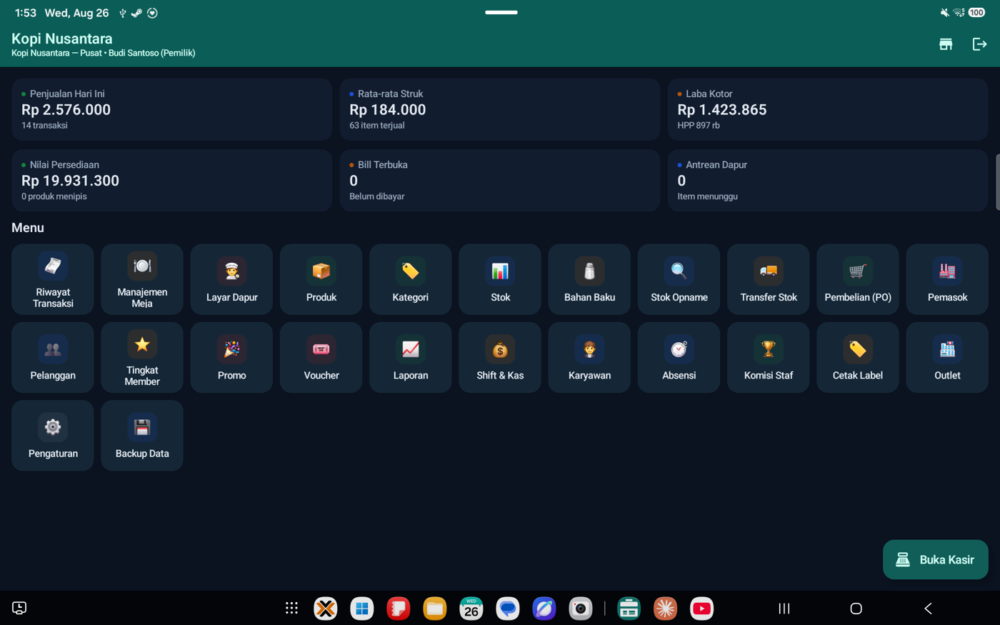

# Dokumentasi DPos Kasir

[English](README.en.md) · **Bahasa Indonesia**

Panduan pemakaian **DPos Kasir**, aplikasi kasir (point of sale) Android untuk toko, kafe, dan
restoran. Berlaku untuk versi **1.4.3**.

Dari dalam aplikasi, panduan ini bisa dibuka lewat **Pengaturan → Bantuan → Panduan Pemakaian**.

## Pilih panduan

| Panduan | Untuk |
| --- | --- |
| **[Panduan Tablet](panduan-tablet.md)** | Tablet Android posisi mendatar. Panduan utama: semua peran, matriks hak akses, pengaturan bahasa, masalah umum, dan catatan perubahan tiap versi. |
| **[Panduan Ponsel](panduan-ponsel.md)** | Ponsel Android posisi tegak. Isi sama dengan versi tablet, ditambah cara memasang, perbedaan tata letak layar sempit, printer Bluetooth saku, dan tips khusus ponsel. |

## Sekilas tentang aplikasi

- **Sepenuhnya luring.** Tidak ada server dan tidak perlu internet. Semua data — produk, stok,
  transaksi, pelanggan, laporan — tersimpan di dalam perangkat. Karena itu **backup rutin adalah
  tanggung jawab pemilik toko**.
- **Lima peran** dengan hak akses berbeda: Pemilik, Manajer, Supervisor, Kasir, dan Dapur.
  Menu yang tidak boleh dibuka sebuah peran tidak muncul sama sekali.
- **Dwibahasa**: Indonesia dan Inggris, termasuk struk dan tiket dapur.
- **Syarat perangkat**: Android 7.0 ke atas. Kamera dipakai untuk memindai barcode; Bluetooth
  untuk printer termal struk dan tiket dapur (58 mm atau 80 mm) serta laci kas.

## Mulai cepat

1. Buka aplikasi. Pada pemasangan pertama, ketuk **Buat Data Contoh** bila ingin mencoba semua
   fitur dengan data demo, atau langsung masuk dengan PIN **`1234`** (Pemilik) untuk toko
   sungguhan.
2. Isi **Pengaturan → Identitas Toko**, pajak, dan service charge.
3. Tambahkan produk di menu **Produk**, lalu karyawan di menu **Karyawan**.
4. **Ganti PIN bawaan `1234`** sebelum perangkat dipakai berjualan.
5. Pasangkan printer Bluetooth di Android, lalu pilih di **Pengaturan → Printer & Laci Kas**.
6. Kasir masuk, buka shift dengan modal awal, dan mulai berjualan.

Langkah lengkapnya ada di [Panduan Tablet](panduan-tablet.md#1-persiapan-awal).

## Alur harian singkat

| Peran | Yang dikerjakan | Panduan |
| --- | --- | --- |
| Kasir | Buka shift → jual → bayar → cetak struk → tutup shift & hitung kas | [Kasir](panduan-tablet.md#4-panduan-peran-kasir) |
| Dapur | Pantau Layar Dapur, ubah status item Antre → Dimasak → Tersaji | [Dapur](panduan-tablet.md#5-panduan-peran-dapur) |
| Supervisor | Kelola meja, proses retur & pembatalan, stok opname | [Supervisor](panduan-tablet.md#6-panduan-peran-supervisor) |
| Manajer | Produk & harga, pembelian (PO), promo, karyawan, pengaturan | [Manajer](panduan-tablet.md#7-panduan-peran-manajer) |
| Pemilik | Laporan & laba, outlet, **backup & restore** | [Pemilik](panduan-tablet.md#8-panduan-peran-pemilik) |

## Ada masalah?

Lihat [Masalah Umum](panduan-tablet.md#9-masalah-umum) di panduan tablet dan
[Tips Khusus Ponsel](panduan-ponsel.md#10-tips-khusus-ponsel) di panduan ponsel.
