# Panduan Pemakaian DPos Kasir — Ponsel Android

[English](phone-guide.md) · **Bahasa Indonesia**

Panduan ini adalah versi **ponsel** dari [Panduan Tablet](panduan-tablet.md). Isinya sama-sama mencakup semua
peran — **Pemilik, Manajer, Supervisor, Kasir, dan Dapur** — tetapi seluruh tangkapan layar diambil
langsung dari ponsel dalam posisi **tegak (potret)**, dan setiap bagian menyorot apa yang **berbeda
dari tablet**.

Perangkat uji: **Samsung Galaxy S20+ (SCV45), Android 12, layar 1440 × 3040 (411 dp)**.
Tangkapan layar diambil dari DPos Kasir 1.0.0; tata letaknya tidak berubah sampai 1.5.0. Fitur
yang ditambahkan sesudahnya — pemilih bahasa, perbaikan layar masuk, perbaikan hitungan kas —
dijelaskan di [Panduan Tablet, bagian Apa yang Baru](panduan-tablet.md#10-apa-yang-baru).

DPos Kasir bekerja sepenuhnya **luring** — tidak ada server, tidak perlu internet. Semua data
tersimpan di dalam ponsel, jadi backup rutin adalah tanggung jawab pemilik.

---

## Daftar Isi

1. [Pemasangan di Ponsel](#1-pemasangan-di-ponsel)
2. [Apa yang Berbeda dari Tablet](#2-apa-yang-berbeda-dari-tablet)
3. [Masuk dan Keluar Aplikasi](#3-masuk-dan-keluar-aplikasi)
4. [Panduan Peran: Kasir](#4-panduan-peran-kasir)
5. [Panduan Peran: Dapur](#5-panduan-peran-dapur)
6. [Panduan Peran: Supervisor](#6-panduan-peran-supervisor)
7. [Panduan Peran: Manajer](#7-panduan-peran-manajer)
8. [Panduan Peran: Pemilik](#8-panduan-peran-pemilik)
9. [Printer Termal Bluetooth](#9-printer-termal-bluetooth)
10. [Tips Khusus Ponsel](#10-tips-khusus-ponsel)

---

## 1. Pemasangan di Ponsel

### 1.1 Memasang aplikasi

Syarat minimum: **Android 7.0** ke atas.

**Dari Google Play** — cara yang disarankan. Pembaruan datang otomatis lewat Play Store.

**Dari berkas APK** — bila Anda menerima berkas APK langsung dari pengembang:

| Berkas | Dipakai untuk |
| --- | --- |
| `…-arm64-v8a.apk` | Hampir semua ponsel keluaran 2017 ke atas (64-bit). **Pilihan utama.** |
| `…-armeabi-v7a.apk` | Ponsel lama 32-bit. |
| `…-universal.apk` | Bila ragu — ukurannya paling besar tetapi jalan di semua. |

Cara memasang berkas APK:

1. Salin berkas APK ke ponsel (kabel USB, kartu memori, atau kirim ke diri sendiri lewat chat).
2. Buka berkas itu lewat aplikasi **File**.
3. Android akan menahan pemasangan dan menawarkan **"Izinkan dari sumber ini"** — nyalakan,
   lalu tekan kembali dan pilih **Pasang**.
4. Peringatan "aplikasi tidak dipindai Play Protect" itu wajar untuk aplikasi di luar Play Store.
   Pilih **Pasang tetap**.

> **Jangan campur jalurnya.** Versi Google Play dan versi APK ditandatangani dengan kunci
> berbeda, jadi berkas APK tidak bisa memperbarui aplikasi yang dipasang dari Play, dan
> sebaliknya. Bila perlu pindah jalur, **backup dulu**, copot aplikasi, pasang versi lain, lalu
> pulihkan backup (lihat [Backup dan restore](#83-backup-dan-restore)).

### 1.2 Pembukaan pertama

Saat dibuka pertama kali database masih kosong. Layar masuk menampilkan panel
**"Belum ada data produk"** berisi tombol *Buat Data Contoh*.

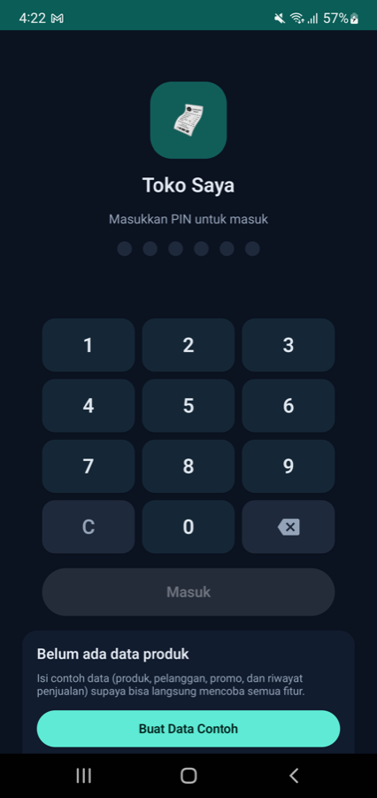

| Pilihan | Kapan dipakai |
| --- | --- |
| **Buat Data Contoh** | Untuk belajar atau demo. Mengisi produk, pelanggan, promo, meja, dan riwayat penjualan. |
| Langsung masuk dengan PIN `1234` | Untuk toko sungguhan. Mulai dari nol, isi sendiri produk dan karyawan. |

Setelah data terisi, layar masuk kembali bersih — hanya papan angka, dengan nama toko di atasnya.

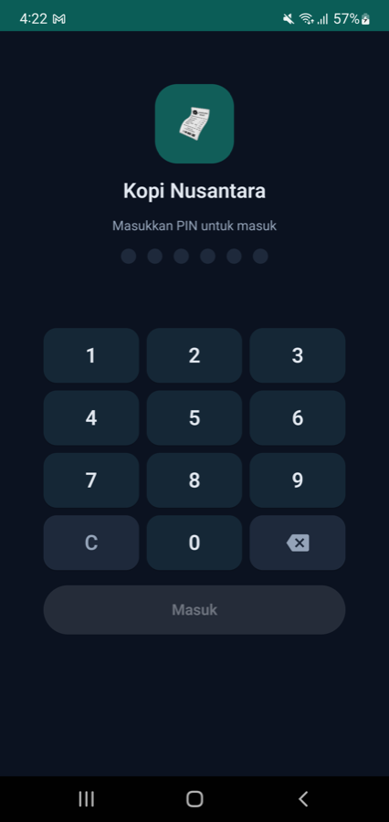

> **Penting.** Di layar ponsel yang sempit, daftar PIN contoh berada di bawah tombol
> *Buat Data Contoh* dan perlu digulir. Panel ini hilang sendiri begitu produk pertama tersimpan.
> Ganti semua PIN bawaan lewat menu **Karyawan** sebelum ponsel dipakai berjualan.

### 1.3 PIN contoh (khusus data demo)

| PIN | Nama | Peran | Outlet |
| --- | --- | --- | --- |
| `1234` | Budi Santoso | Pemilik | Kopi Nusantara — Pusat |
| `2345` | Siti Rahayu | Manajer | Kopi Nusantara — Pusat |
| `3456` | Andi Pratama | Supervisor | Kopi Nusantara — Pusat |
| `4567` | Dewi Lestari | Kasir | Kopi Nusantara — Pusat |
| `5678` | Rizky Maulana | Kasir | Cabang Bandung |
| `9999` | Dapur | Dapur | Kopi Nusantara — Pusat |

---

## 2. Apa yang Berbeda dari Tablet

Aplikasi mengganti tata letak secara otomatis pada ambang **lebar layar 720 dp**. Ponsel tegak
(±411 dp) berada di bawah ambang itu, jadi:

| Bagian | Tablet (≥ 720 dp) | Ponsel tegak (< 720 dp) |
| --- | --- | --- |
| Layar Kasir | Katalog dan keranjang berdampingan | Katalog satu layar penuh, keranjang jadi **panel geser** |
| Total belanja | Selalu terlihat di panel kanan | Ada di **bar bawah**: jumlah item, total, tombol *Keranjang* dan *Bayar* |
| Kartu ringkasan beranda | 3 kolom | **2 kolom** |
| Menu beranda | Muat satu layar | Perlu **digulir** ke bawah |
| Grid produk kasir | 4–5 kolom | **3 kolom** |
| Grid meja | 4–6 kolom | **3 kolom** |

Semua fungsi tetap ada — tidak ada fitur yang hilang di ponsel, hanya susunannya yang menumpuk
ke bawah.

### 2.1 Memutar ponsel ke mendatar

Ponsel dalam posisi **mendatar (landscape)** melewati ambang 720 dp, sehingga tampilannya
berubah menjadi tata letak tablet — keranjang muncul sebagai panel tetap di sebelah kanan.

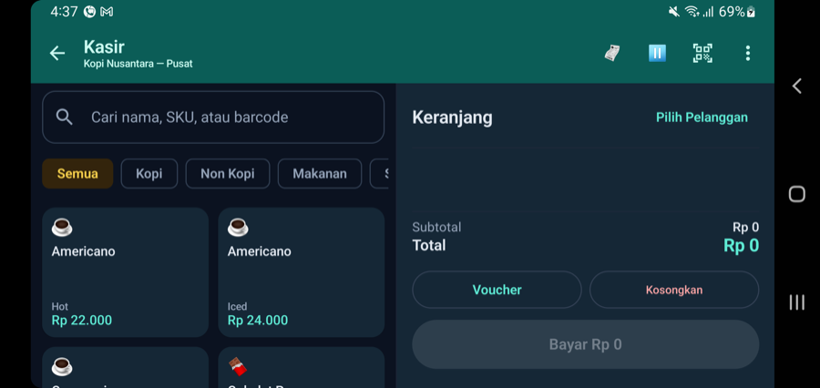

Berguna saat jam sibuk. Kelemahannya: tinggi layar tinggal sedikit, sehingga daftar produk yang
terlihat jadi lebih pendek. Pastikan **putar otomatis** ponsel aktif bila ingin memakai cara ini.

---

## 3. Masuk dan Keluar Aplikasi

### 3.1 Masuk

Ketuk PIN di papan angka lalu tekan **Masuk**. Aplikasi langsung membawa Anda ke beranda sesuai
peran. Kasir dan peran lain akan ditanya soal **buka shift** lebih dulu.

### 3.2 Pembatasan percobaan PIN

Layar masuk sengaja tidak memberi tahu apakah PIN yang salah itu ada atau tidak.

- **4 percobaan** gratis. Sisa percobaan ditampilkan di layar.

  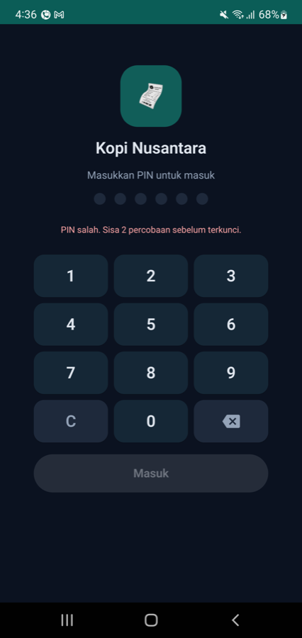

- Percobaan ke-5 dan seterusnya mengunci layar: 15 detik, lalu berlipat dua setiap kegagalan,
  maksimal 15 menit. Hitung mundur berjalan sendiri.

  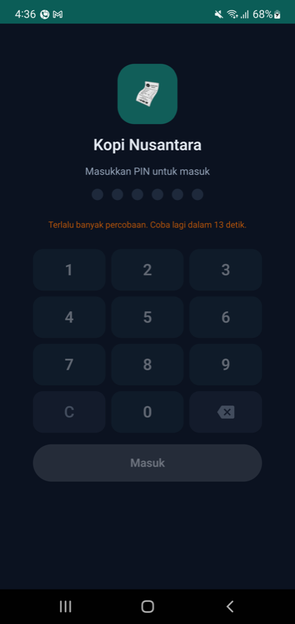

### 3.3 Keluar

Ketuk ikon **keluar** (↦) di pojok kanan atas beranda, lalu konfirmasi. Anda otomatis
**absen keluar** (clock-out). Shift yang masih terbuka **tetap tersimpan** dan bisa dilanjutkan
saat masuk lagi.

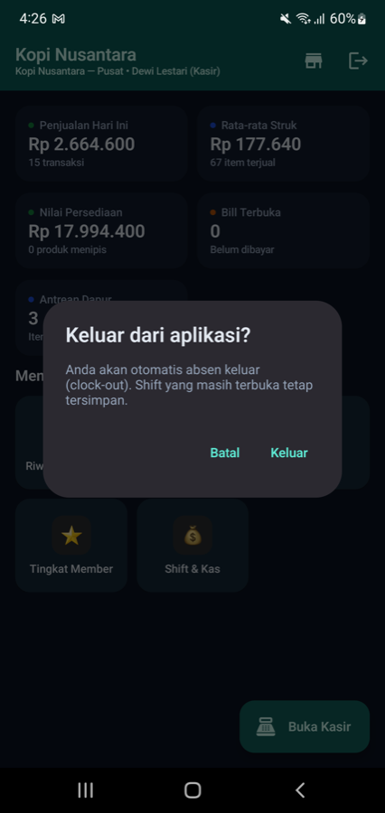

### 3.4 Berpindah outlet

Ikon **toko** (🏪) di sebelah ikon keluar membuka daftar outlet.

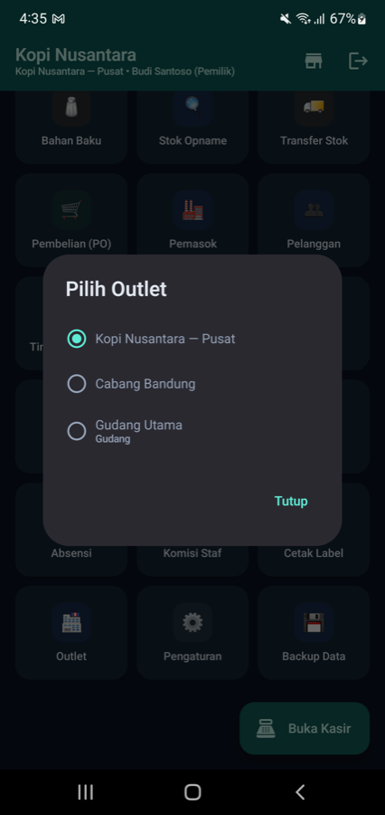

---

## 4. Panduan Peran: Kasir

### 4.1 Buka shift

Setelah masuk, kasir diminta mencatat uang tunai di laci sebagai **modal awal (float cash)**.
Angka ini dipakai untuk menghitung selisih kas saat tutup shift. Tersedia pintasan
*100rb / 200rb / 500rb / 1000rb*.

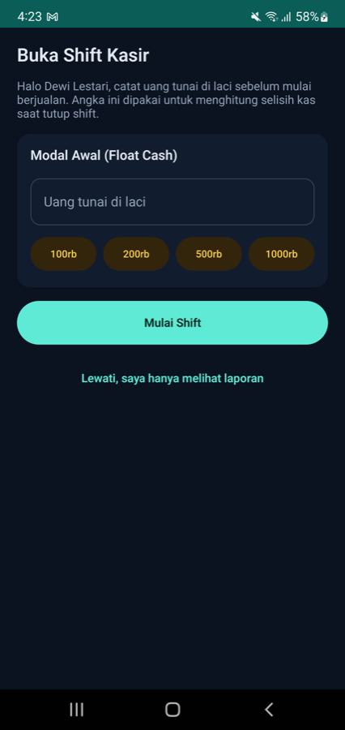

Tautan **"Lewati, saya hanya melihat laporan"** dipakai bila Anda hanya ingin melihat data tanpa
berjualan.

### 4.2 Beranda kasir

Kartu ringkasan tersusun **dua kolom**, menu di bawahnya, dan tombol besar **Buka Kasir**
mengambang di pojok kanan bawah.

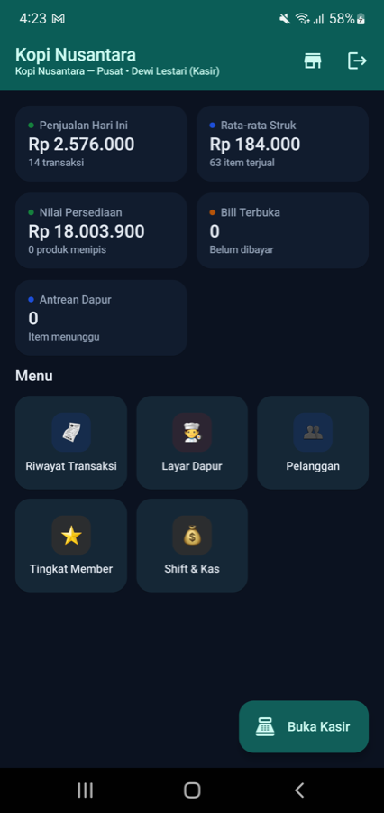

### 4.3 Layar jual

Produk tampil **tiga kolom**. Di atas ada kotak cari (nama, SKU, barcode) dan baris kategori yang
bisa digeser ke samping. Ikon di kepala layar: 🧾 bill terbuka, ⏸️ transaksi ditahan (hold),
pemindai barcode, dan ⋮ opsi lain.

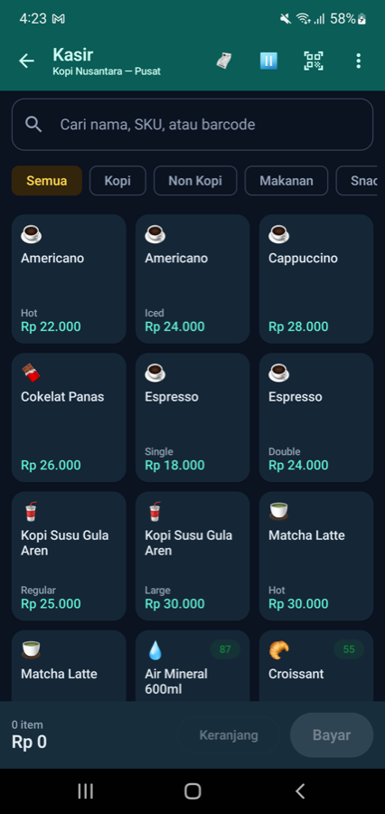

Ketuk produk untuk menambah ke keranjang. **Bar bawah** langsung memperbarui jumlah item dan
total — inilah pengganti panel keranjang tablet.

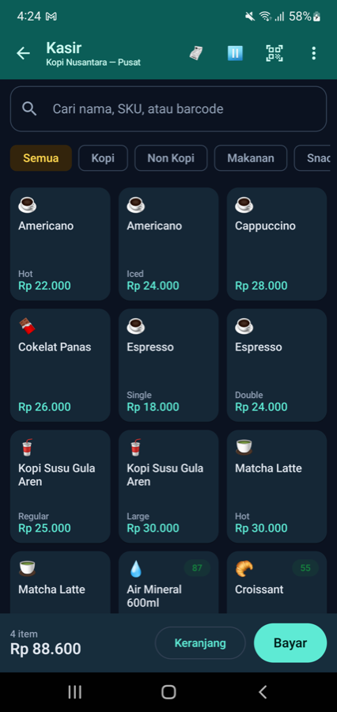

### 4.4 Keranjang

Ketuk **Keranjang** di bar bawah untuk membuka panel geser. Tarik gagangnya ke atas agar panel
memenuhi layar — di situ terlihat rincian item, promo yang otomatis terpakai, service charge,
pajak, pembulatan, dan poin pelanggan.

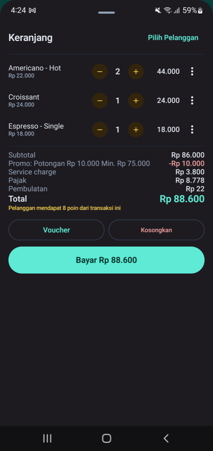

- Tombol **−** dan **+** mengubah jumlah; ikon ⋮ pada tiap baris untuk catatan atau diskon item.
- **Pilih Pelanggan** di kanan atas panel untuk menempelkan member.
- **Voucher** untuk memasukkan kode; **Kosongkan** untuk membatalkan seluruh keranjang.

### 4.5 Pembayaran

Tekan **Bayar** untuk membuka layar pembayaran: ringkasan tagihan di atas, uang tunai di tengah
(lengkap dengan pintasan nominal), dan **Metode Lain** — QRIS, kartu debit, kartu kredit, dan
sebagainya — di bawahnya.

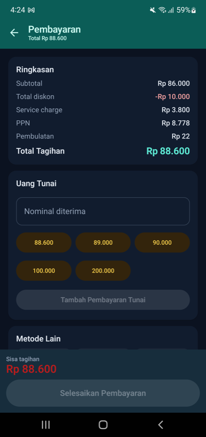

Isi nominal, tekan **Tambah Pembayaran Tunai**, lalu kembalian muncul di bar bawah. Pembayaran
bisa digabung (misalnya sebagian tunai, sisanya QRIS).

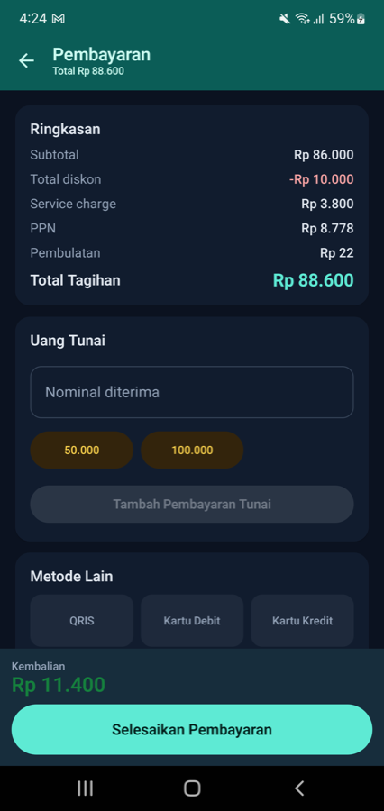

Tekan **Selesaikan Pembayaran** untuk menutup transaksi.

### 4.6 Struk

Layar struk memberi tiga pilihan: kirim struk digital (WhatsApp, Email, SMS, Bagikan), cetak ke
printer termal, dan pratinjau struk. Tombol **Transaksi Baru** langsung membuka keranjang kosong.

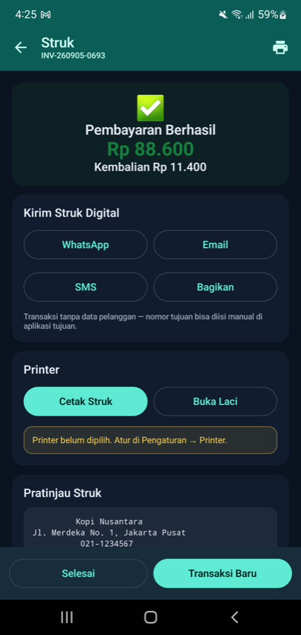

> Bila muncul peringatan *"Printer belum dipilih"*, atur dulu lewat
> [Pengaturan → Printer](#9-printer-termal-bluetooth).

### 4.7 Shift dan kas

Menu **Shift & Kas** menampilkan shift berjalan: jam buka, durasi, jumlah transaksi, total
penjualan, modal awal, dan **kas seharusnya**.

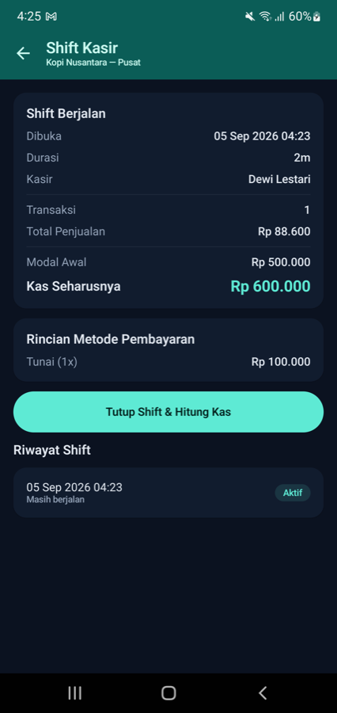

### 4.8 Tutup shift

Tekan **Tutup Shift & Hitung Kas**, masukkan uang tunai yang benar-benar dihitung di laci.
Aplikasi menghitung **selisih** secara langsung. Catatan bersifat opsional, dan laporan shift
bisa langsung dicetak.

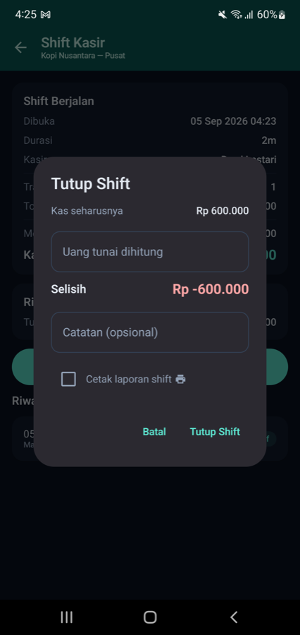

---

## 5. Panduan Peran: Dapur

Peran Dapur hanya punya satu menu: **Layar Dapur**. Cocok dipakai di ponsel kedua yang ditaruh
di area masak.

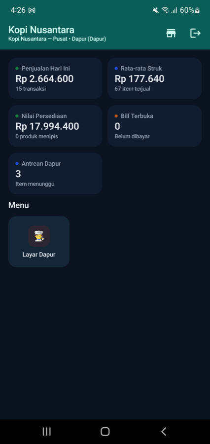

### 5.1 Layar Dapur

Setiap pesanan tampil sebagai kartu berisi nomor faktur, waktu tunggu, dan daftar item beserta
statusnya.

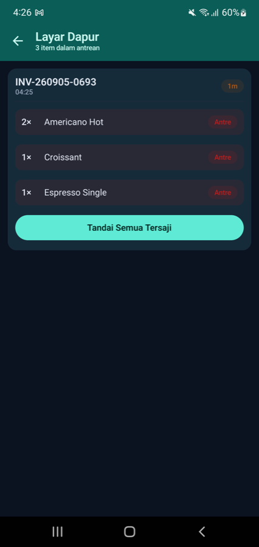

### 5.2 Mengubah status item

Ketuk lencana status pada baris item untuk memutarnya: **Antre → Dimasak → Tersaji**.
Tombol **Tandai Semua Tersaji** menyelesaikan satu kartu sekaligus.

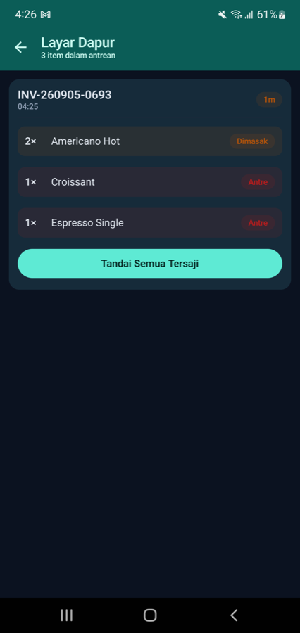

> Bila dapur memakai **printer tiket Bluetooth** dan bukan layar, atur printer dapur di
> [Pengaturan → Printer](#9-printer-termal-bluetooth). Layar Dapur boleh tetap menyala sebagai
> cadangan.

---

## 6. Panduan Peran: Supervisor

Beranda supervisor menambahkan Manajemen Meja, Stok, Bahan Baku, dan Stok Opname. Bila shift
belum dibuka, muncul spanduk peringatan oranye.

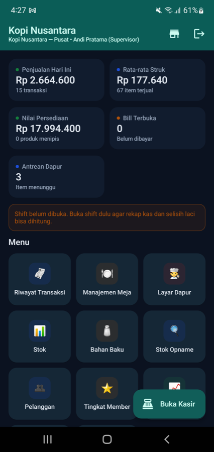

### 6.1 Manajemen meja

Meja dikelompokkan per area (Indoor, Outdoor, VIP) dengan warna status: hijau kosong, merah
terisi, oranye reservasi, biru sudah bill. Di ponsel grid-nya **tiga kolom**.

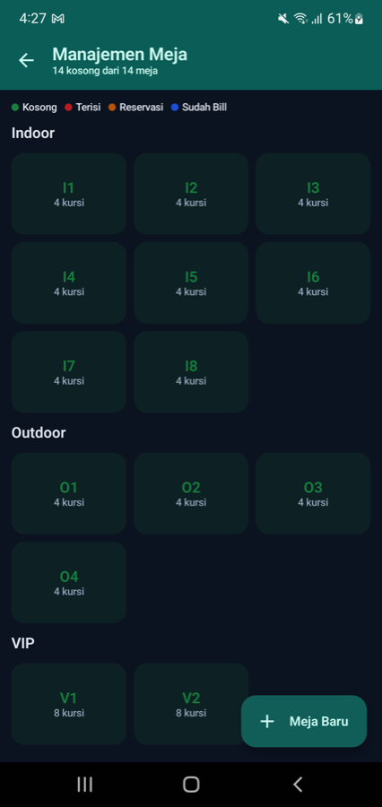

Ketuk satu meja untuk membuka panel aksi: **Buat Pesanan**, *Reservasi*, *Kosongkan*, *Ubah*,
dan *Hapus*.

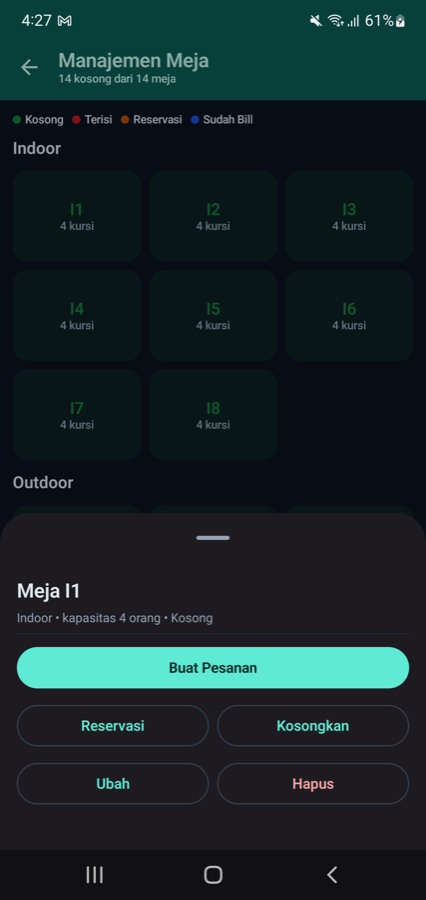

### 6.2 Retur dan refund

Buka **Riwayat Transaksi**, saring per periode atau cari nomor faktur.

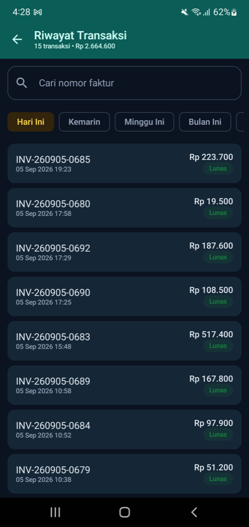

Ketuk satu transaksi untuk melihat rinciannya. Di bawah layar tersedia **Retur / Refund** dan
**Batalkan**.

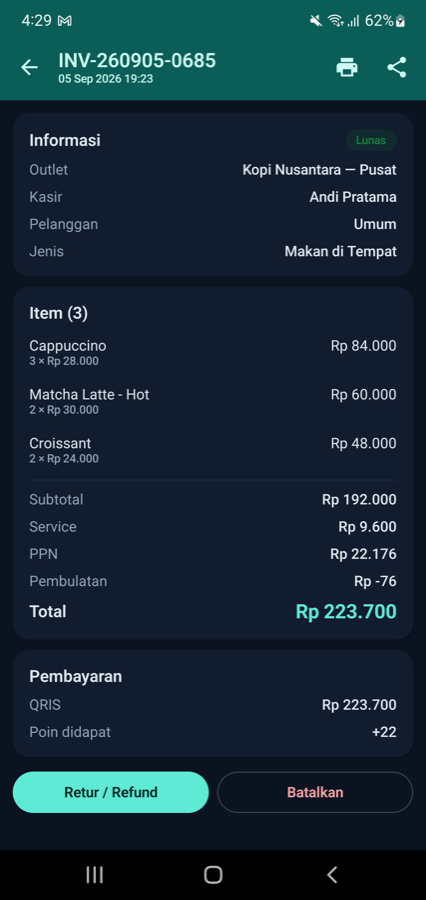

Di layar retur, tentukan jumlah tiap item yang dikembalikan, apakah barang **dikembalikan ke
stok**, dan metode pengembalian dana. Stok, poin, dan laporan keuangan menyesuaikan otomatis.

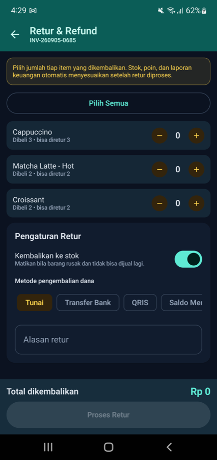

### 6.3 Stok opname

**Stok Opname → Opname Baru** membuat draf berisi seluruh produk berstok. Isi kolom **Fisik**
sesuai hasil hitung; sakelar *Tampilkan hanya yang selisih* mempercepat pemeriksaan. Tekan
**Posting Penyesuaian** untuk menerapkannya.

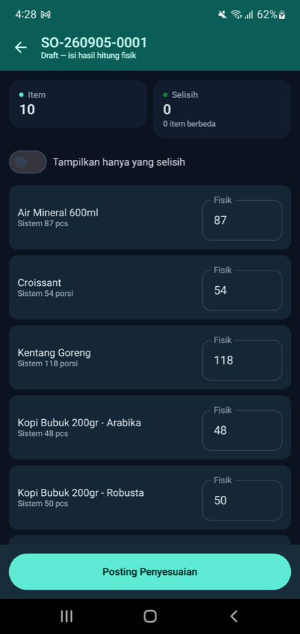

---

## 7. Panduan Peran: Manajer

Beranda manajer menambahkan kartu **Laba Kotor** dan menu yang jauh lebih panjang — di ponsel
menu ini perlu digulir.

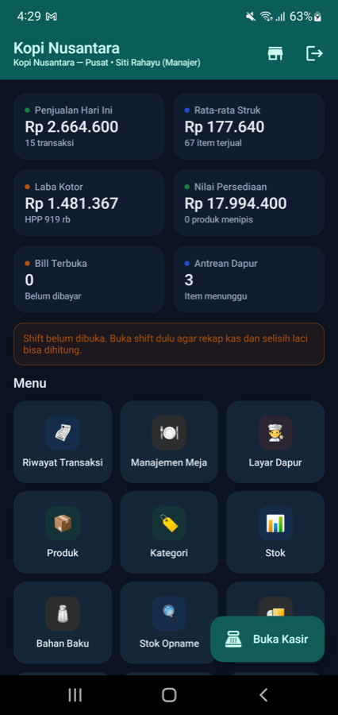

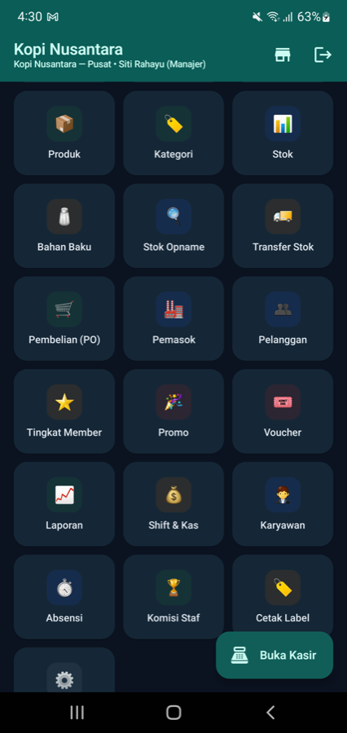

### 7.1 Produk dan harga

Daftar produk memuat SKU, kategori, harga, penanda stok, dan bintang untuk produk favorit yang
muncul lebih dulu di layar kasir.

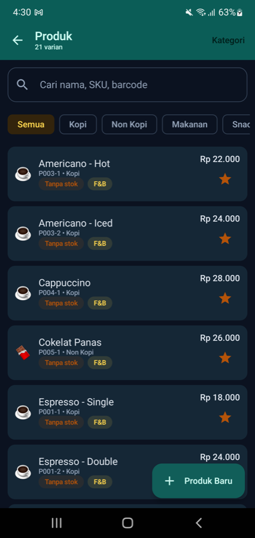

### 7.2 Pembelian (Purchase Order)

Alurnya empat langkah:

1. **PO Baru** → pilih pemasok, isi catatan, tekan *Buat*.

   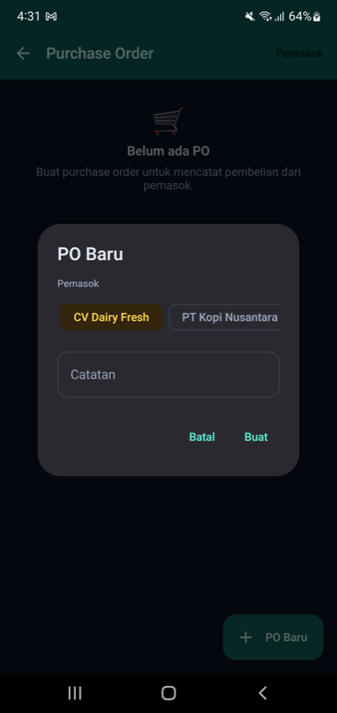
2. Tambahkan item lewat tombol **+**, isi jumlah dan harga beli satuan.

   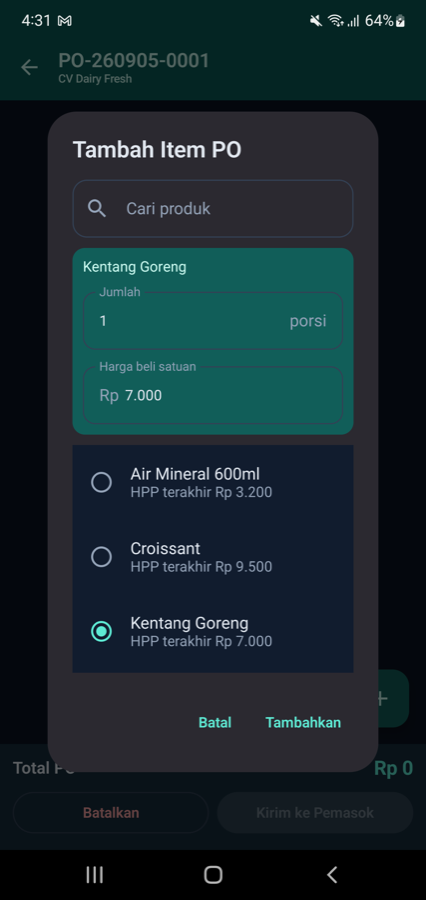

3. Setelah semua item masuk, tekan **Kirim ke Pemasok**.

   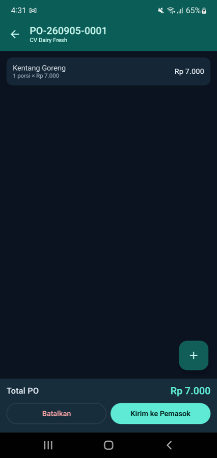

   Status PO berubah menjadi menunggu barang, dan tombolnya berganti jadi *Terima Barang*.

   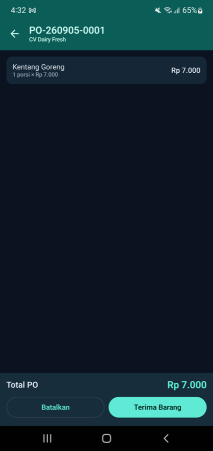

4. Saat barang datang, tekan **Terima Barang** dan isi jumlah yang benar-benar diterima.
   Stok bertambah dan **HPP diperbarui memakai rata-rata bergerak**.

   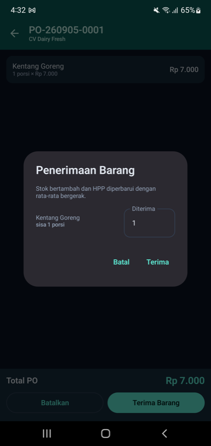

Penerimaan boleh sebagian — sisanya tetap tercatat sebagai kekurangan.

### 7.3 Promo dan voucher

Promo yang aktif diterapkan **otomatis** di layar kasir saat syaratnya terpenuhi; kasir tidak
perlu memasukkan kode apa pun. Voucher berkode diatur di tab terpisah di kanan atas.

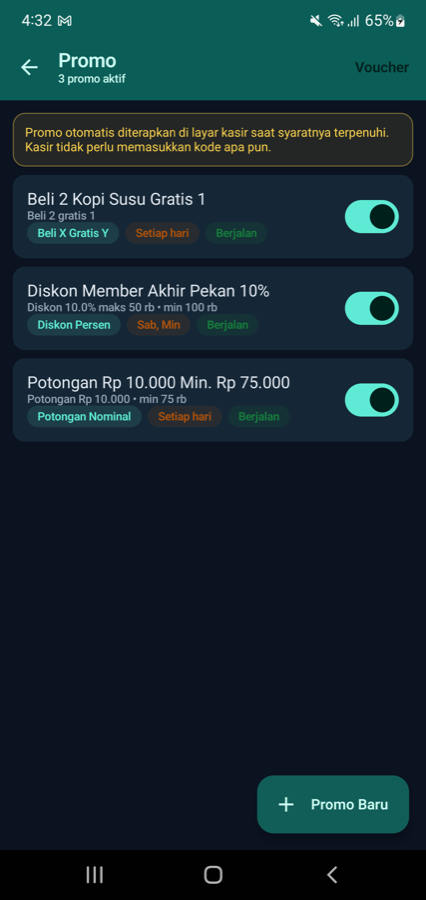

### 7.4 Karyawan dan hak akses

Setiap karyawan punya PIN yang disimpan dalam bentuk **hash** — PIN lama tidak bisa dibaca ulang,
hanya bisa diganti.

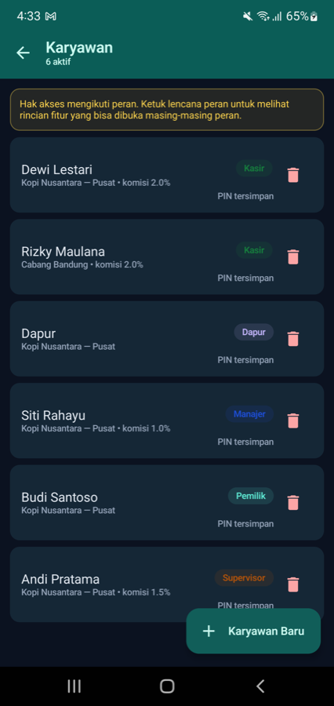

Ketuk lencana peran untuk melihat rincian fitur yang bisa dibuka peran tersebut.

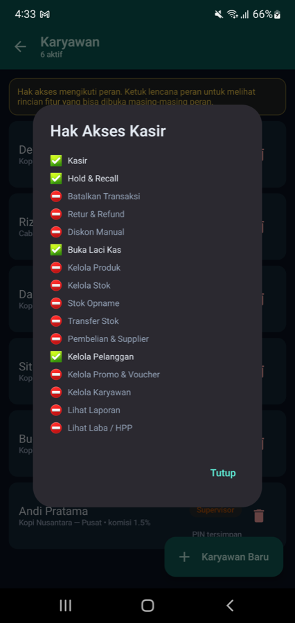

### 7.5 Pengaturan toko

Identitas toko (nama, alamat, telepon, awalan nomor faktur), pajak, service charge, mode bisnis,
dan format struk semuanya di satu layar bergulir. Tombol **Simpan Pengaturan** menempel di bawah.

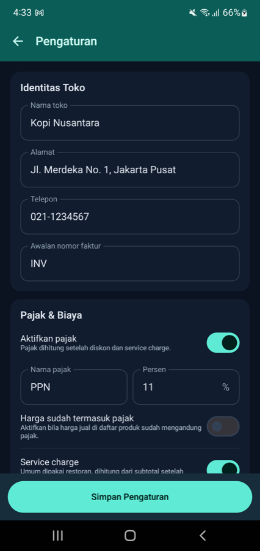

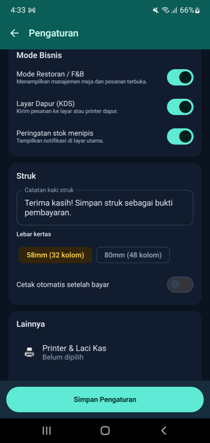

Untuk struk ponsel, **58 mm (32 kolom)** adalah ukuran printer saku yang paling umum;
80 mm dipakai printer meja.

---

## 8. Panduan Peran: Pemilik

Pemilik memiliki seluruh menu manajer ditambah **Outlet** dan **Backup Data**.

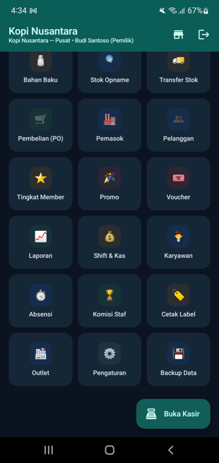

### 8.1 Laporan

Laporan punya saringan periode (Hari Ini, Kemarin, Minggu Ini, Bulan Ini, 30 hari) dan empat tab:
**Ringkasan, Produk, Pembayaran, Waktu**. Di ponsel, tab dan periode digeser ke samping. Ikon
bagikan di kanan atas mengekspor ringkasan sebagai teks.

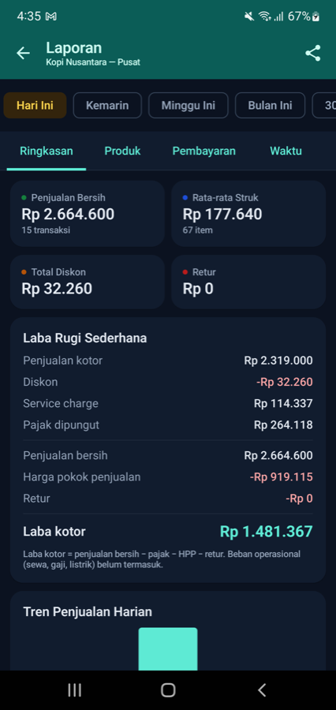

Laba kotor dihitung sebagai penjualan bersih − pajak − HPP − retur. Beban operasional (sewa, gaji,
listrik) **tidak** termasuk.

### 8.2 Outlet

Tiap outlet punya stok sendiri. Perpindahan barang antar outlet dilakukan lewat **Transfer Stok**,
bukan dengan mengubah stok langsung.

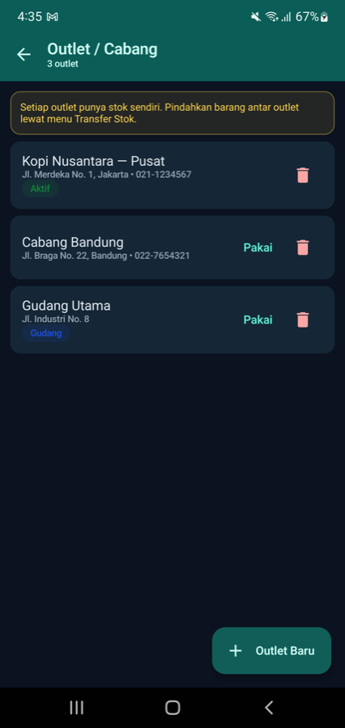

### 8.3 Backup dan restore

Karena seluruh data hanya ada di dalam ponsel, **backup adalah satu-satunya pengaman** bila
ponsel hilang, rusak, atau dicuri.

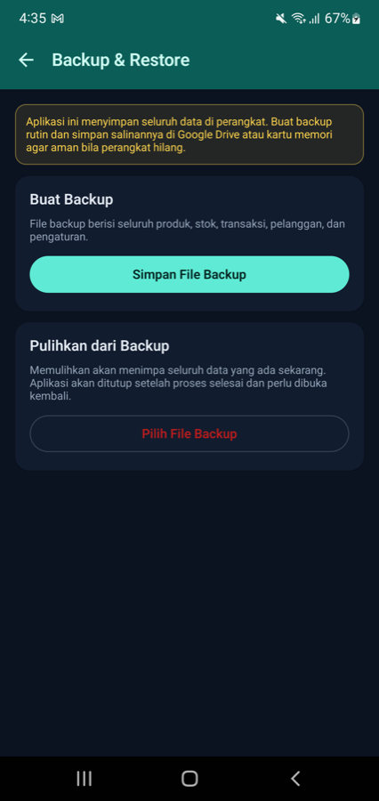

- **Simpan File Backup** menghasilkan satu berkas berisi produk, stok, transaksi, pelanggan,
  dan pengaturan. Simpan salinannya di Google Drive atau kartu memori.
- **Pilih File Backup** memulihkan data dan **menimpa seluruh data yang ada sekarang**.
  Aplikasi menutup diri setelah proses selesai dan perlu dibuka kembali.

> Ponsel jauh lebih mudah hilang daripada tablet kasir. Biasakan backup setiap tutup toko.

---

## 9. Printer Termal Bluetooth

Ini bagian yang paling sering dipakai pada pemasangan berbasis ponsel, karena printer saku
Bluetooth adalah pasangan yang wajar untuk kasir bergerak.

Urutannya:

1. **Pasangkan printer lebih dulu lewat Pengaturan Bluetooth bawaan Android** — bukan dari dalam
   aplikasi. Aplikasi hanya membaca daftar perangkat yang sudah terpasang.
2. Buka **Pengaturan → Printer & Laci Kas** di DPos Kasir.
3. Tekan **Berikan Izin Bluetooth** dan setujui permintaan izin Android.
4. Pilih printer dari **Perangkat Terpasang**. Tombol *Untuk struk* menentukan apakah perangkat
   itu dipakai untuk struk kasir atau tiket dapur.
5. Uji dengan **Tes Cetak**, dan **Buka Laci** bila laci kas tersambung ke printer.

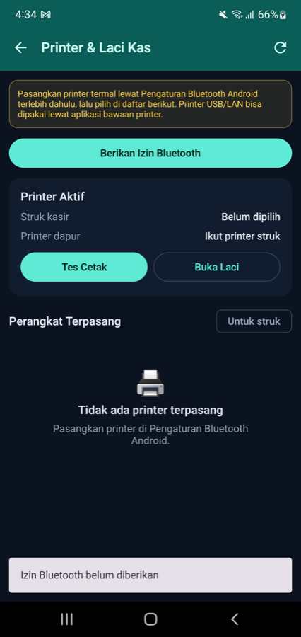

Catatan:

- Printer **USB atau LAN** tidak didukung langsung; pakai aplikasi bawaan printer tersebut.
- **Printer dapur** bisa dibiarkan *Ikut printer struk* bila hanya ada satu printer.
- Sakelar **Cetak otomatis setelah bayar** di bagian *Struk* menghilangkan satu ketukan tiap
  transaksi.

---

## 10. Tips Khusus Ponsel

| Situasi | Saran |
| --- | --- |
| Layar mati saat melayani antrean | Setel *Layar mati* Android ke 5 menit atau lebih, atau nyalakan mode "tetap menyala saat mengisi daya" di Opsi Pengembang. |
| Jam sibuk, ingin lihat keranjang terus-menerus | Putar ponsel ke posisi mendatar — tata letak berubah jadi dua kolom seperti tablet. |
| Tombol bawah tertutup bilah navigasi | Tarik panel keranjang ke atas sampai penuh; tombol *Bayar* akan naik ke area yang aman. |
| Ponsel dipakai bergantian antar shift | Selalu **Keluar** (bukan sekadar mengunci layar) supaya absensi dan shift tercatat pada orang yang benar. |
| Baterai kritis di tengah shift | Data transaksi tersimpan segera setelah pembayaran selesai; mati mendadak tidak menghilangkan struk yang sudah lunas, tetapi keranjang yang belum dibayar akan hilang. |
| Ponsel hilang atau dicuri | Tidak ada server, jadi data tidak bisa dihapus dari jarak jauh. Pemulihan hanya lewat berkas backup terakhir — pastikan rutin. |

### Masalah umum

| Gejala | Penyebab dan penanganan |
| --- | --- |
| "Aplikasi tidak dapat dipasang" | APK tidak cocok dengan prosesor — pakai varian `universal`. Atau aplikasi yang sama sudah terpasang dari Google Play; lihat [Jangan campur jalurnya](#11-memasang-aplikasi). |
| Layar masuk terkunci | Terlalu banyak PIN salah. Tunggu hitung mundur selesai; durasinya berlipat sampai 15 menit. |
| Printer tidak muncul di daftar | Belum dipasangkan di Pengaturan Bluetooth Android, atau izin Bluetooth belum diberikan di aplikasi. |
| Struk tercetak terpotong | Lebar kertas salah. Ubah di **Pengaturan → Struk → Lebar kertas**. |
| Menu yang dicari tidak terlihat | Beranda ponsel lebih panjang daripada tablet — gulir ke bawah. |
| Selisih kas selalu minus | Modal awal diisi lebih besar daripada uang yang sebenarnya ada di laci saat buka shift. |
