# Panduan Pemakaian DPos Kasir — Tablet

[English](tablet-guide.md) · **Bahasa Indonesia**

Panduan langkah demi langkah untuk semua peran: **Pemilik, Manajer, Supervisor, Kasir, dan Dapur**.
Berlaku untuk **DPos Kasir 1.4.3**. Tangkapan layar diambil dari tablet Android
(Samsung SM-X400, posisi mendatar); sebagian besar berasal dari versi 1.0.0 dan masih
sesuai karena tata letaknya tidak berubah.

DPos Kasir bekerja sepenuhnya **luring** — tidak ada server, tidak perlu internet. Semua data
tersimpan di dalam tablet, jadi backup rutin adalah tanggung jawab pemilik.

Aplikasi tersedia dalam **bahasa Indonesia dan Inggris**. Panduan ini memakai istilah
bahasa Indonesia; lihat [Bahasa aplikasi](#14-bahasa-aplikasi) untuk padanan istilahnya.

Memakai ponsel? Lihat [Panduan Ponsel](panduan-ponsel.md) — isinya sama, dengan tangkapan layar
tegak dan catatan khusus layar sempit.

---

## Daftar Isi

1. [Persiapan Awal](#1-persiapan-awal)
2. [Masuk dan Keluar Aplikasi](#2-masuk-dan-keluar-aplikasi)
3. [Peran dan Hak Akses](#3-peran-dan-hak-akses)
4. [Panduan Peran: Kasir](#4-panduan-peran-kasir)
5. [Panduan Peran: Dapur](#5-panduan-peran-dapur)
6. [Panduan Peran: Supervisor](#6-panduan-peran-supervisor)
7. [Panduan Peran: Manajer](#7-panduan-peran-manajer)
8. [Panduan Peran: Pemilik](#8-panduan-peran-pemilik)
9. [Masalah Umum](#9-masalah-umum)
10. [Apa yang Baru](#10-apa-yang-baru)

---

## 1. Persiapan Awal

### 1.1 Pemasangan pertama

Saat aplikasi dibuka pertama kali, database masih kosong. Layar masuk menampilkan panel
**"Belum ada data produk"** berisi tombol *Buat Data Contoh* dan daftar PIN bawaan.

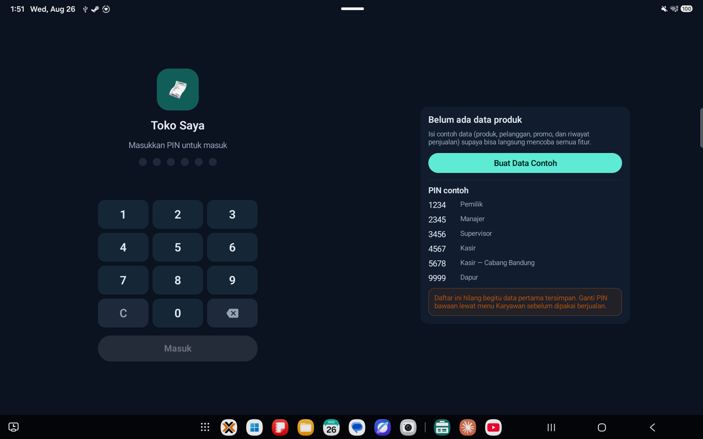

Dua pilihan:

| Pilihan | Kapan dipakai |
| --- | --- |
| **Buat Data Contoh** | Untuk belajar atau demo. Mengisi produk, pelanggan, promo, meja, dan riwayat penjualan agar semua fitur langsung bisa dicoba. |
| Langsung masuk dengan PIN `1234` | Untuk toko sungguhan. Anda mulai dari nol dan mengisi sendiri produk serta karyawan. |

> **Penting.** Panel PIN contoh hanya muncul selama belum ada satu pun produk tersimpan.
> Begitu data pertama masuk, panel itu hilang sendiri. Ganti semua PIN bawaan lewat menu
> **Karyawan** sebelum tablet dipakai berjualan.

### 1.2 Setelah data terisi

Layar masuk kembali bersih — hanya papan angka. Nama toko di atas papan angka mengikuti
pengaturan **Identitas Toko**.

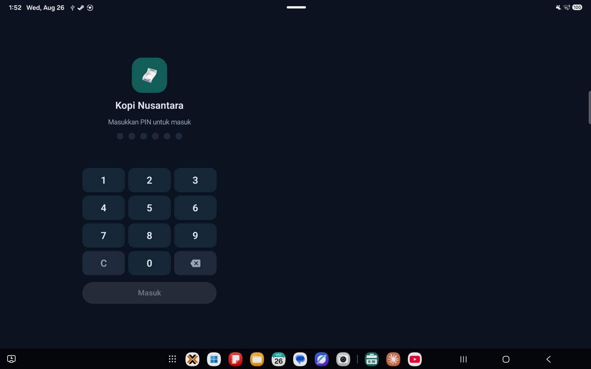

### 1.3 PIN contoh (khusus data demo)

| PIN | Nama | Peran | Outlet |
| --- | --- | --- | --- |
| `1234` | Budi Santoso | Pemilik | Kopi Nusantara — Pusat |
| `2345` | Siti Rahayu | Manajer | Kopi Nusantara — Pusat |
| `3456` | Andi Pratama | Supervisor | Kopi Nusantara — Pusat |
| `4567` | Dewi Lestari | Kasir | Kopi Nusantara — Pusat |
| `5678` | Rizky Maulana | Kasir | Cabang Bandung |
| `9999` | Dapur | Dapur | Kopi Nusantara — Pusat |

### 1.4 Bahasa aplikasi

Sejak versi 1.4.0 seluruh antarmuka tersedia dalam **bahasa Indonesia dan Inggris** —
termasuk struk, tiket dapur, laporan shift, dan pesan galat.

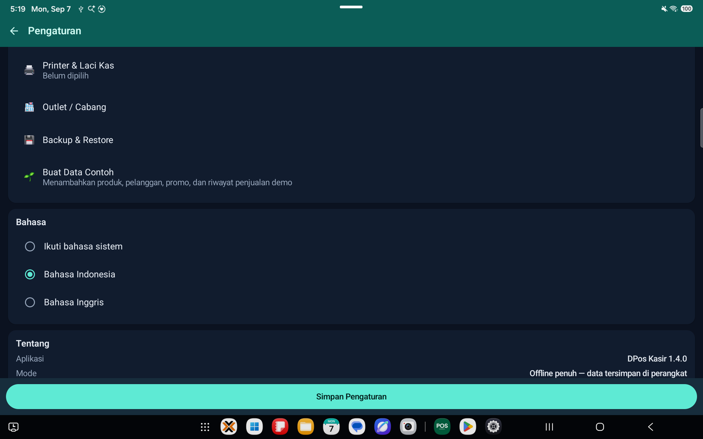

Buka **Pengaturan → Bahasa**, lalu pilih salah satu:

| Pilihan | Artinya |
| --- | --- |
| **Ikuti bahasa sistem** | Bawaan. Tablet berbahasa Inggris menampilkan aplikasi dalam bahasa Inggris; bahasa lain apa pun jatuh ke bahasa Indonesia. |
| **Bahasa Indonesia** | Selalu Indonesia, apa pun bahasa tablet. |
| **Bahasa Inggris** | Selalu Inggris, apa pun bahasa tablet. |

Layar langsung berganti begitu pilihan diketuk — tidak perlu menekan **Simpan Pengaturan**
dan tidak perlu menutup aplikasi. Pilihannya tersimpan dan tetap berlaku setelah tablet
dimatikan.

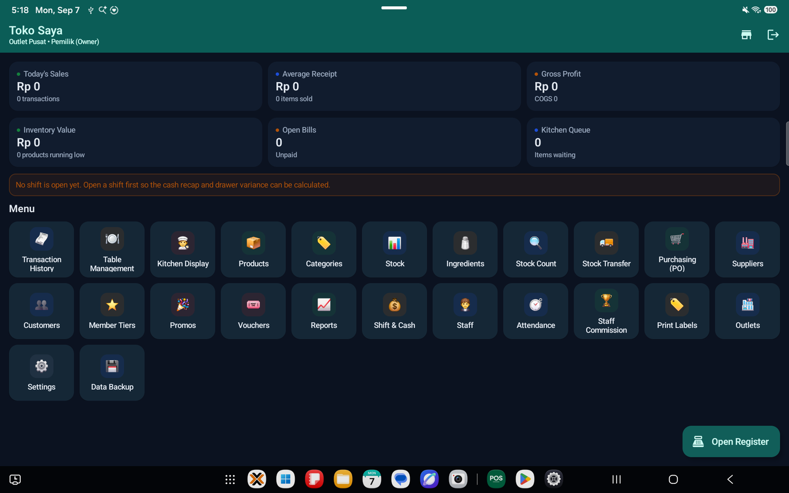

> **Siapa yang bisa mengubahnya.** Pemilih bahasa ada di dalam layar Pengaturan, jadi hanya
> **Pemilik dan Manajer** yang bisa membukanya. Kasir, Supervisor, dan Dapur ikut bahasa yang
> sudah dipilih. Pilihan ini berlaku untuk seluruh tablet, bukan per karyawan.

#### Yang tetap berbahasa Indonesia

Beberapa hal sengaja tidak ikut berganti:

| Tetap Indonesia | Alasan |
| --- | --- |
| Data yang Anda isi sendiri: nama toko, nama produk, nama karyawan, catatan kaki struk | Itu isi database Anda, bukan teks aplikasi. |
| Catatan mutasi stok, mis. "Selisih opname OPN-260907-0001" | Jejak audit yang dicatat sekali saat kejadian. Kalau diterjemahkan, riwayat lama dan baru akan beda bahasa di layar yang sama. |
| Format rupiah: `Rp 25.000` | Mata uangnya memang selalu Rupiah. Yang ikut bahasa hanya singkatannya: `rb`/`jt`/`M` menjadi `K`/`M`/`B`. |

#### Padanan istilah

Bila tablet dipakai dalam bahasa Inggris, panduan ini masih bisa diikuti dengan padanan berikut:

| Indonesia | Inggris |
| --- | --- |
| Kasir | Cashier |
| Keranjang | Cart |
| Bayar / Pembayaran | Pay / Payment |
| Struk | Receipt |
| Riwayat Transaksi | Transaction History |
| Produk / Kategori | Products / Categories |
| Stok / Stok Opname | Stock / Stock Count |
| Transfer Stok | Stock Transfer |
| Pembelian (PO) | Purchasing (PO) |
| Pemasok | Suppliers |
| Pelanggan / Tingkat Member | Customers / Member Tiers |
| Promo / Voucher | Promos / Vouchers |
| Laporan | Reports |
| Shift & Kas | Shift & Cash |
| Karyawan / Absensi | Staff / Attendance |
| Manajemen Meja | Table Management |
| Layar Dapur | Kitchen Display |
| Pengaturan | Settings |
| Backup Data | Data Backup |
| Buka Kasir | Open Register |

---

## 2. Masuk dan Keluar Aplikasi

### 2.1 Masuk

1. Ketik PIN di papan angka (4–8 digit).
2. Tekan **Masuk**.

Yang terjadi otomatis saat berhasil masuk:

- Anda **absen masuk** (clock-in) — tercatat di menu Absensi.
- Outlet aktif mengikuti outlet yang terpasang pada akun Anda.
- Kalau Anda punya hak Kasir dan belum ada shift terbuka, aplikasi langsung membuka layar
  **Buka Shift Kasir**. Peran Dapur dilewati karena tidak memegang uang.

### 2.2 Pembatasan percobaan PIN

Layar masuk sengaja tidak memberi tahu apakah PIN yang salah itu ada atau tidak, agar tidak
membantu orang menebak akun.

- **4 percobaan** gratis. Sisa percobaan ditampilkan di layar.
- Percobaan ke-5 dan seterusnya mengunci layar: 15 detik, lalu berlipat dua setiap kegagalan,
  maksimal 15 menit. Hitung mundur berjalan sendiri di layar.

### 2.3 Keluar

Ketuk ikon **keluar** (↦) di pojok kanan atas beranda, lalu konfirmasi. Anda otomatis
**absen keluar** (clock-out). Shift yang masih terbuka **tetap tersimpan** dan bisa dilanjutkan
saat masuk lagi.

### 2.4 Berpindah outlet

Ikon **toko** (🏪) di sebelah ikon keluar membuka daftar outlet. Berguna bila satu tablet dipakai
untuk lebih dari satu cabang atau gudang.

---

## 3. Peran dan Hak Akses

Hak akses melekat pada peran, bukan pada orang. Menu yang tidak boleh dibuka **tidak muncul sama
sekali** di beranda — bukan sekadar diberi tanda kunci.

Untuk melihat rincian hak sebuah peran: buka **Karyawan**, lalu ketuk lencana peran di baris
karyawan.

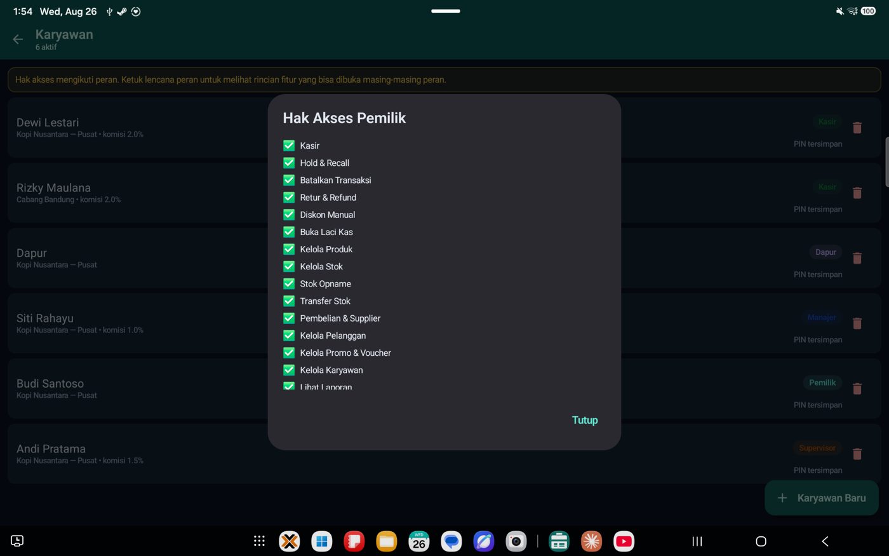

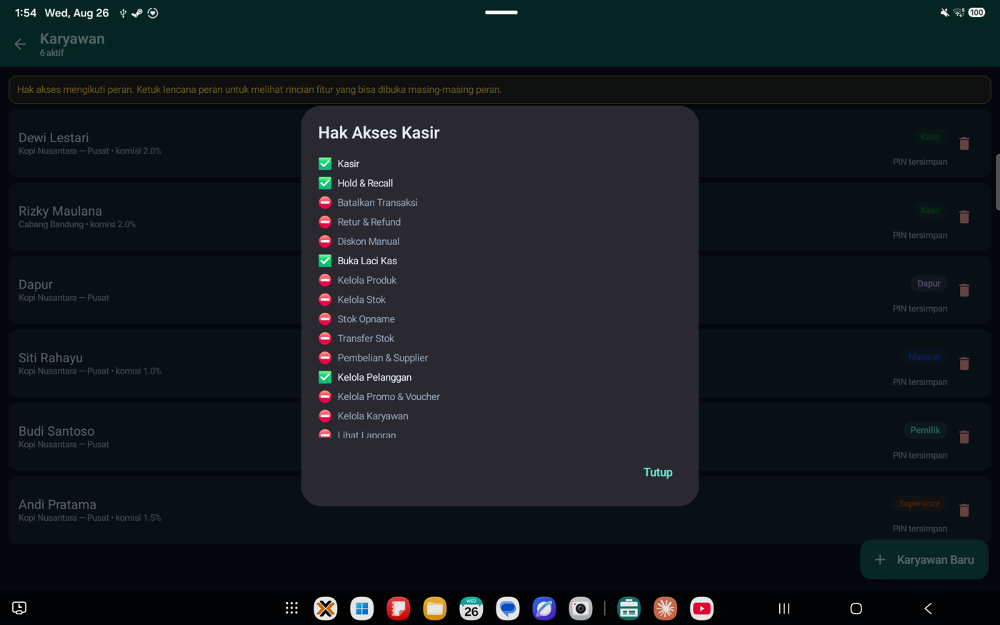

### 3.1 Matriks hak akses

| Fitur | Pemilik | Manajer | Supervisor | Kasir | Dapur |
| --- | :-: | :-: | :-: | :-: | :-: |
| Kasir (jual) | ✅ | ✅ | ✅ | ✅ | — |
| Hold & Recall | ✅ | ✅ | ✅ | ✅ | — |
| Buka Laci Kas | ✅ | ✅ | ✅ | ✅ | — |
| Kelola Pelanggan | ✅ | ✅ | ✅ | ✅ | — |
| Layar Dapur | ✅ | ✅ | ✅ | ✅ | ✅ |
| Batalkan Transaksi | ✅ | ✅ | ✅ | — | — |
| Retur & Refund | ✅ | ✅ | ✅ | — | — |
| Diskon Manual | ✅ | ✅ | ✅ | — | — |
| Kelola Stok | ✅ | ✅ | ✅ | — | — |
| Stok Opname | ✅ | ✅ | ✅ | — | — |
| Kelola Meja | ✅ | ✅ | ✅ | — | — |
| Lihat Laporan | ✅ | ✅ | ✅ | — | — |
| Kelola Produk | ✅ | ✅ | — | — | — |
| Transfer Stok | ✅ | ✅ | — | — | — |
| Pembelian & Pemasok | ✅ | ✅ | — | — | — |
| Kelola Promo & Voucher | ✅ | ✅ | — | — | — |
| Kelola Karyawan | ✅ | ✅ | — | — | — |
| Lihat Laba / HPP | ✅ | ✅ | — | — | — |
| Pengaturan | ✅ | ✅ | — | — | — |
| Kelola Outlet | ✅ | — | — | — | — |
| Backup & Restore | ✅ | — | — | — | — |

Pembatasan ini dirancang untuk mencegah kecurangan: kasir tidak bisa mengubah harga, memberi
diskon sendiri, membatalkan transaksi, atau melihat laba.

### 3.2 Beranda per peran

Perbedaan hak akses langsung terlihat dari jumlah kartu menu di beranda.

**Pemilik** — 24 menu, termasuk Outlet dan Backup Data.

**Manajer** — 22 menu; Outlet dan Backup Data tidak ada.

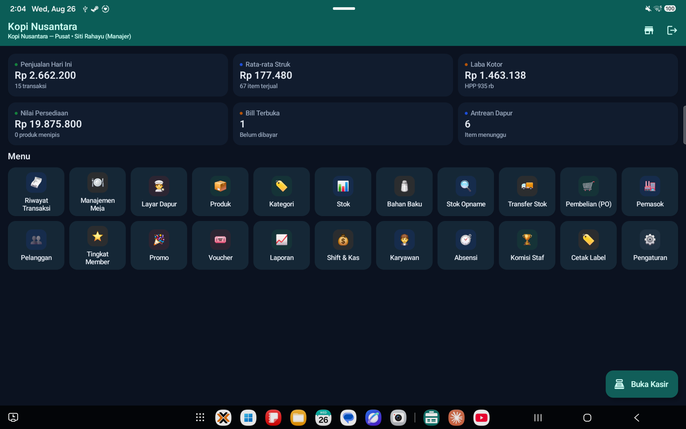

**Supervisor** — 12 menu; kartu **Laba Kotor** tidak ditampilkan.

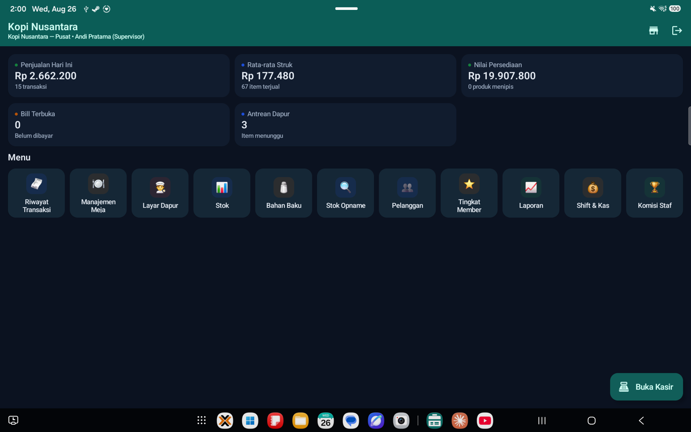

**Kasir** — 5 menu; tanpa Laba Kotor dan tanpa Manajemen Meja.

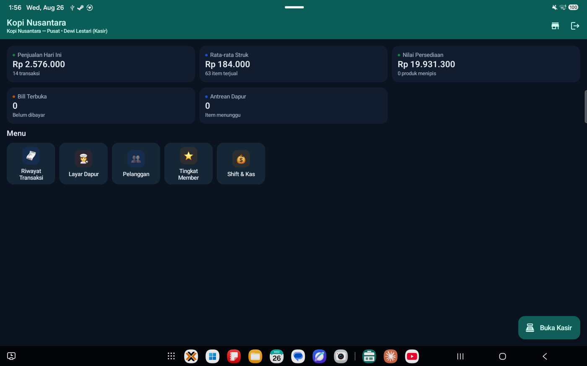

**Dapur** — 1 menu, tanpa tombol Buka Kasir.

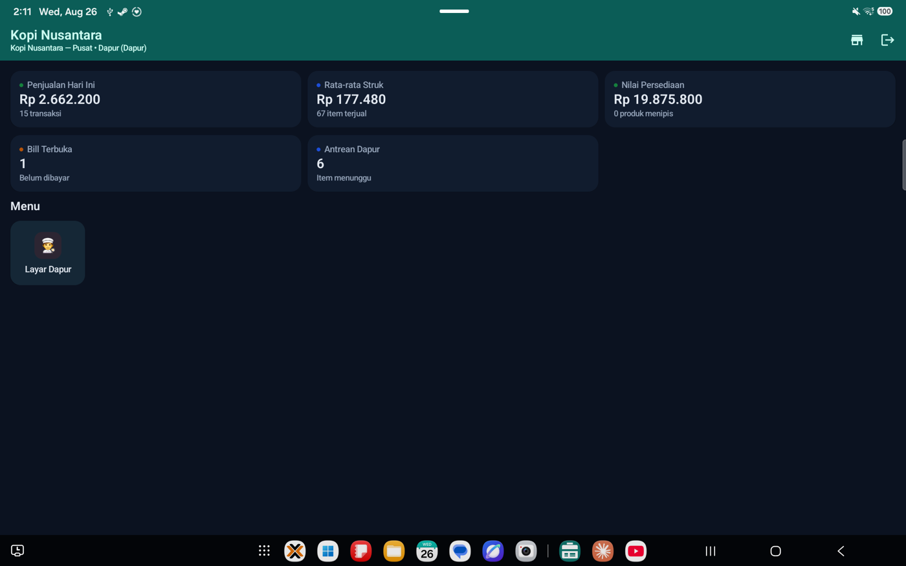

---

## 4. Panduan Peran: Kasir

Tugas harian: buka shift → layani penjualan → tutup shift dan hitung kas.

### 4.1 Buka shift

Setelah masuk, isi **Modal Awal (Float Cash)** — uang tunai yang benar-benar ada di laci sebelum
mulai berjualan. Ada tombol cepat 100rb / 200rb / 500rb / 1000rb.

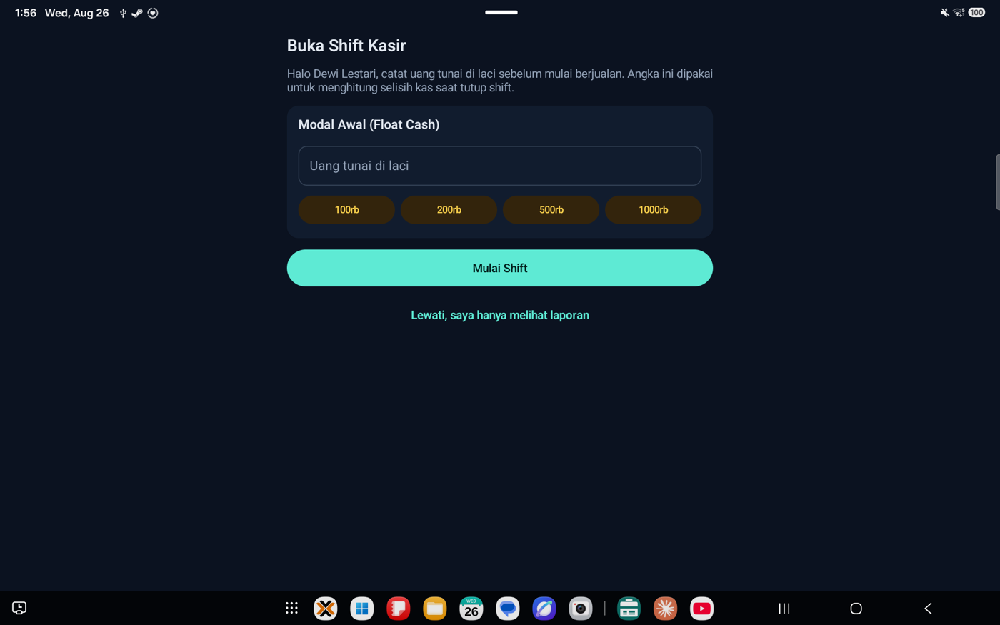

Angka ini dipakai untuk menghitung selisih kas saat tutup shift. Tekan **Mulai Shift**.

> Tautan *"Lewati, saya hanya melihat laporan"* dipakai bila Anda masuk hanya untuk mengecek
> data dan tidak akan menerima uang.

### 4.2 Membuat transaksi

Tekan tombol **Buka Kasir** di kanan bawah beranda.

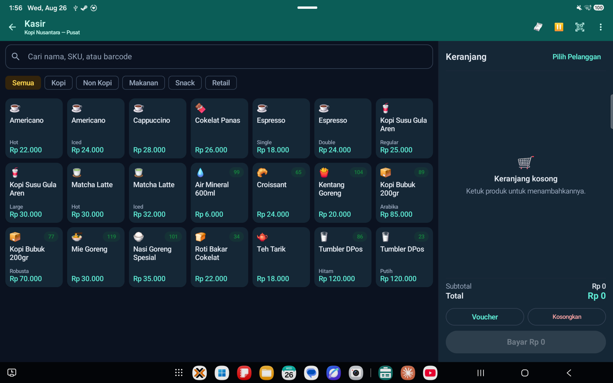

Bagian layar:

- **Kiri** — kotak cari (nama, SKU, atau barcode), tab kategori, dan kisi produk. Angka hijau di
  pojok kartu adalah sisa stok; produk tanpa angka berarti tidak dilacak stoknya.
- **Kanan** — keranjang, ringkasan biaya, dan tombol bayar.
- **Atas** — 🧾 bill terbuka, ⏸️ keranjang ditahan, pemindai barcode, dan ⋮ opsi transaksi.

Ketuk kartu produk untuk menambahkannya. Ketuk lagi untuk menambah jumlah, atau pakai tombol
− / + di keranjang.

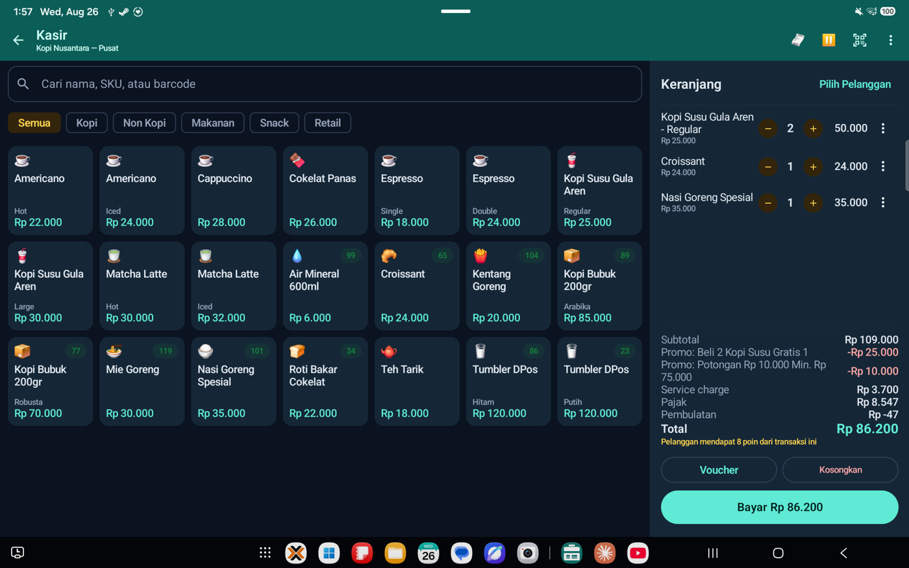

**Promo berjalan otomatis.** Kasir tidak perlu memasukkan kode apa pun — begitu syaratnya
terpenuhi, potongan langsung muncul di ringkasan, lengkap dengan namanya. Service charge, pajak,
pembulatan, dan perolehan poin pelanggan juga dihitung di situ.

### 4.3 Opsi transaksi (ikon ⋮)

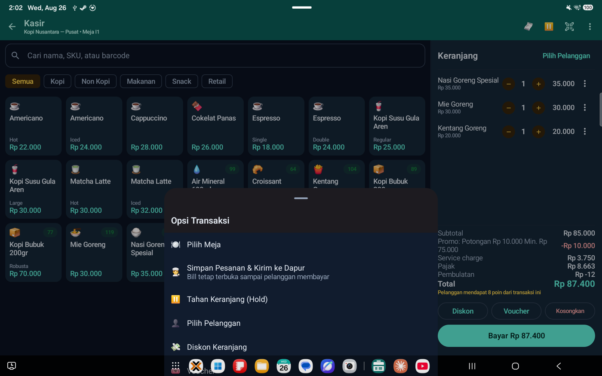

| Opsi | Keterangan |
| --- | --- |
| **Pilih Meja** | Mengaitkan keranjang ke sebuah meja (mode F&B). |
| **Simpan Pesanan & Kirim ke Dapur** | Bill tetap terbuka sampai pelanggan membayar; item masuk antrean dapur. |
| **Tahan Keranjang (Hold)** | Menyimpan keranjang sementara dengan nama, lalu bisa dipanggil lagi lewat ikon ⏸️. |
| **Pilih Pelanggan** | Mengaitkan transaksi ke member agar poin tercatat. |
| **Diskon Keranjang** | Hanya muncul untuk Supervisor ke atas. |

### 4.4 Pembayaran

Tekan **Bayar Rp …**.

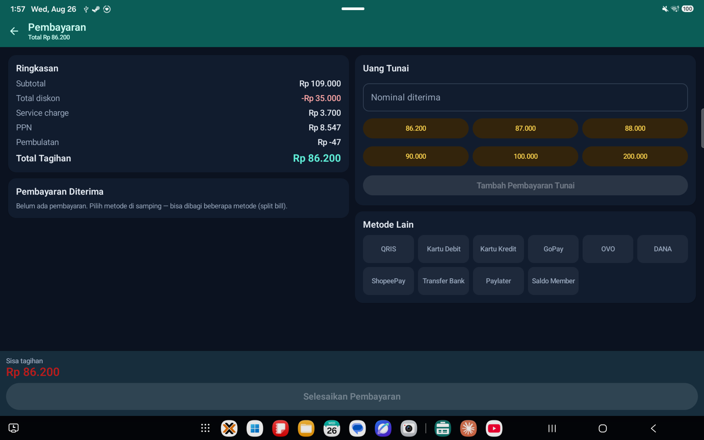

- **Uang Tunai** — ketik nominal atau pakai tombol cepat, lalu **Tambah Pembayaran Tunai**.
- **Metode Lain** — QRIS, Kartu Debit, Kartu Kredit, GoPay, OVO, DANA, ShopeePay, Transfer Bank,
  Paylater, Saldo Member.

Satu transaksi boleh dibayar dengan beberapa metode sekaligus (*split bill*). Sisa tagihan
terlihat di bawah dan berkurang setiap kali pembayaran ditambahkan.

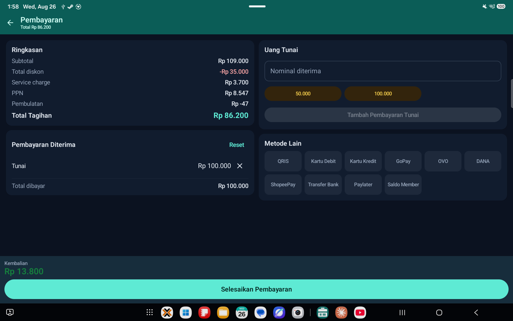

Setelah cukup, tekan **Selesaikan Pembayaran**.

### 4.5 Struk

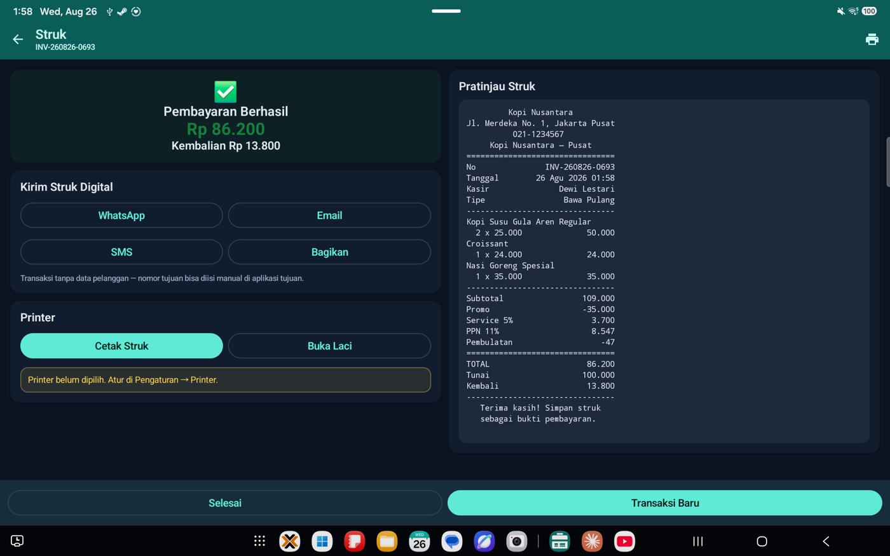

- **Kirim Struk Digital** — WhatsApp, Email, SMS, atau Bagikan.
- **Cetak Struk** — perlu printer Bluetooth yang sudah dipilih di *Pengaturan → Printer*.
- **Buka Laci** — mengirim perintah buka laci ke printer.
- **Transaksi Baru** — langsung kembali ke layar kasir untuk pelanggan berikutnya.

### 4.6 Tutup shift

Buka menu **Shift & Kas**.

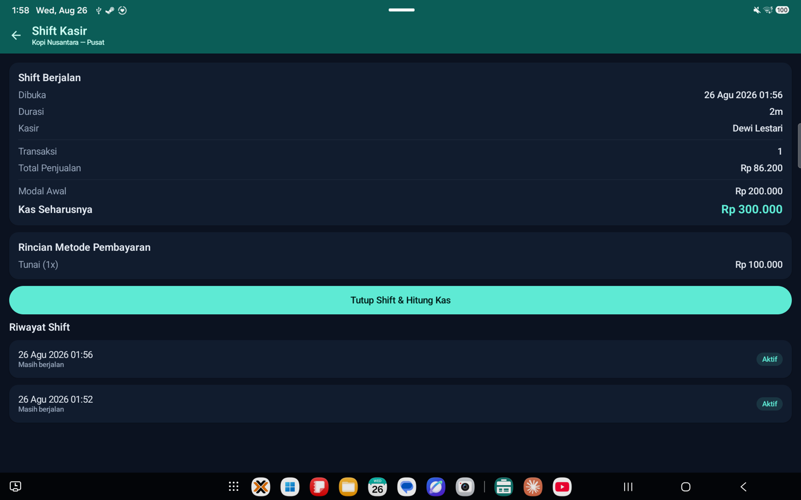

Layar ini menunjukkan lama shift, jumlah transaksi, total penjualan, modal awal, **Kas Seharusnya**,
dan rincian per metode pembayaran.

Tekan **Tutup Shift & Hitung Kas**, lalu masukkan uang tunai hasil hitungan fisik di laci.

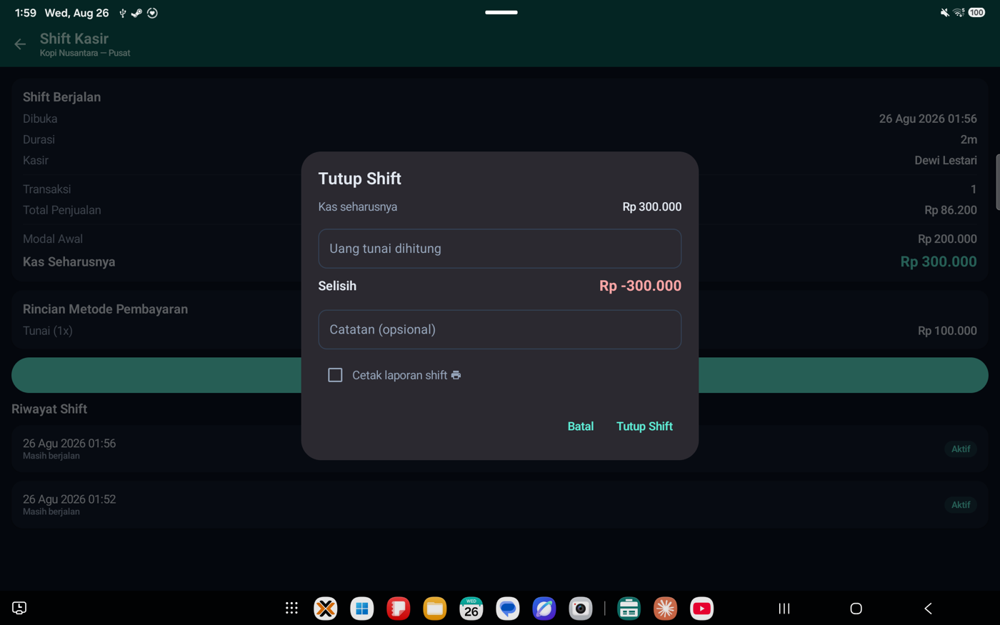

Selisih dihitung otomatis. Isi **Catatan** bila ada selisih yang perlu dijelaskan, centang
*Cetak laporan shift* bila diperlukan, lalu tekan **Tutup Shift**.

---

## 5. Panduan Peran: Dapur

Akun Dapur hanya punya satu menu dan tidak bisa membuka kasir maupun melihat angka penjualan
selain kartu ringkasan.

### 5.1 Layar Dapur (KDS)

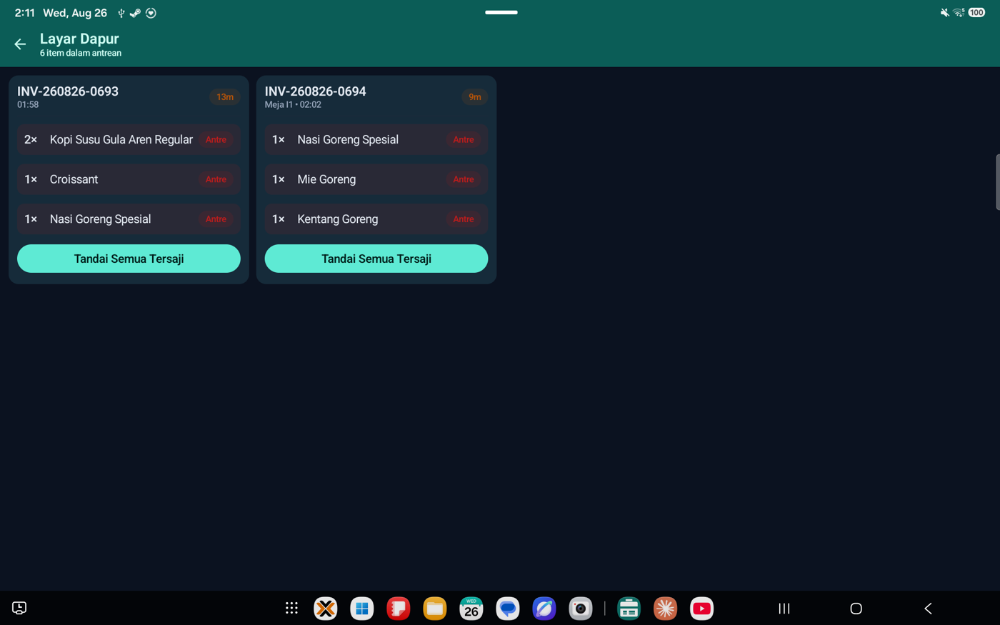

Setiap kartu adalah satu pesanan: nomor faktur, nomor meja (bila ada), jam masuk, dan **lama
menunggu** di pojok kanan.

### 5.2 Mengubah status item

Ketuk baris item untuk memajukan statusnya: **Antre → Dimasak → Tersaji**.

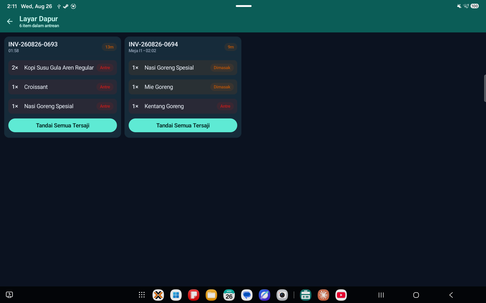

Tombol **Tandai Semua Tersaji** menyelesaikan seluruh item dalam satu pesanan sekaligus, dan
kartu itu langsung hilang dari antrean.

---

## 6. Panduan Peran: Supervisor

Supervisor punya semua kemampuan Kasir, ditambah wewenang yang tidak boleh dipegang kasir:
membatalkan transaksi, memproses retur, memberi diskon manual, mengelola meja dan stok, serta
melihat laporan (tanpa laba).

### 6.1 Manajemen meja

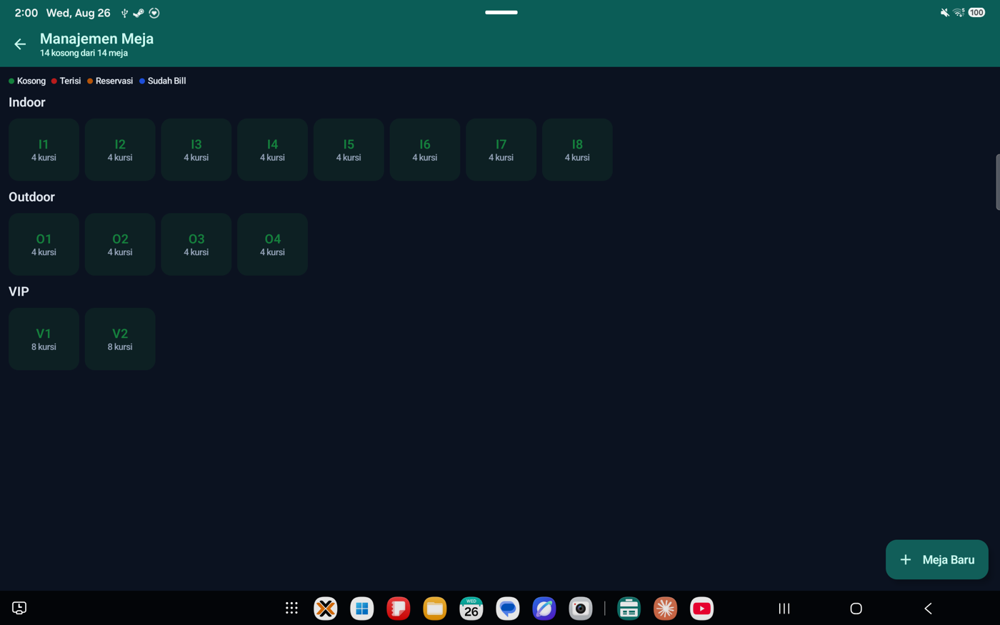

Meja dikelompokkan per area (Indoor, Outdoor, VIP) dengan empat status berwarna:
🟢 Kosong · 🔴 Terisi · 🟠 Reservasi · 🔵 Sudah Bill.

Ketuk sebuah meja untuk membuka pilihan aksinya.

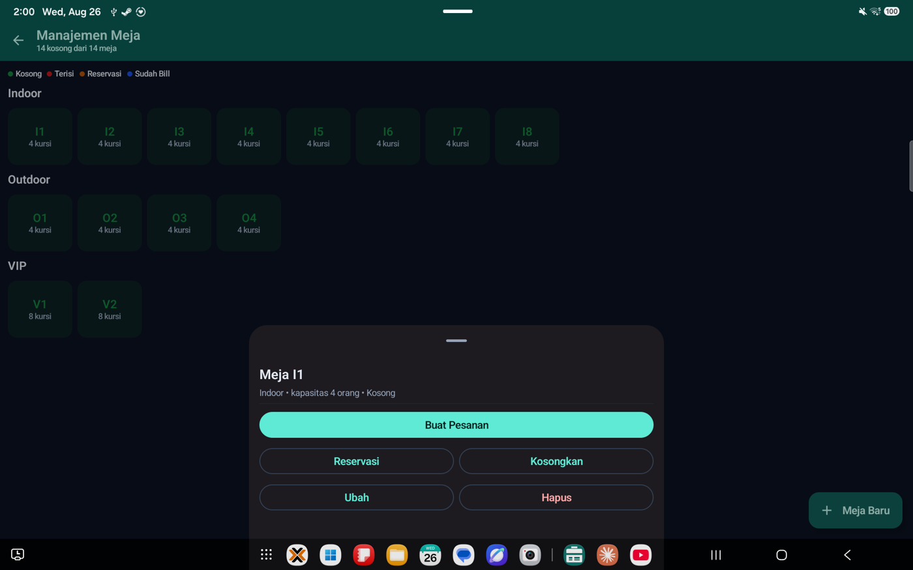

| Aksi | Keterangan |
| --- | --- |
| **Buat Pesanan** | Membuka layar kasir yang sudah terikat ke meja itu. |
| **Reservasi** | Menandai meja sebagai dipesan. |
| **Kosongkan** | Mengembalikan meja ke status kosong. |
| **Ubah / Hapus** | Mengubah nama, kapasitas, area, atau menghapus meja. |

Di layar kasir yang terikat meja, subjudul menampilkan nomor mejanya. Perhatikan tombol
**Diskon** — tombol ini tidak ada pada akun Kasir.

Setelah *Simpan Pesanan & Kirim ke Dapur*, meja berubah merah dan menampilkan nilai bill
berjalan.

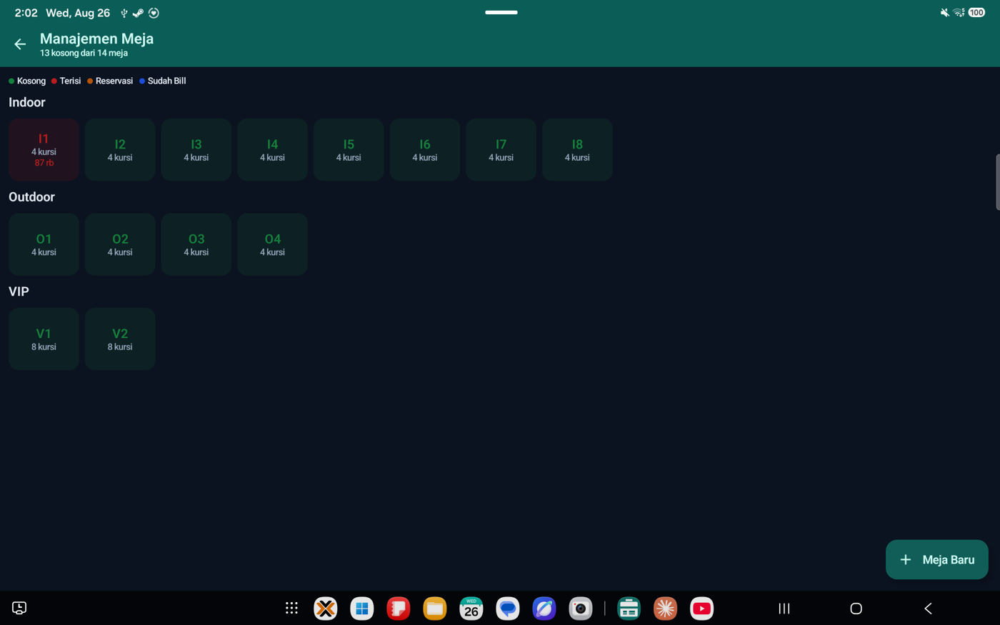

### 6.2 Retur dan refund

Buka **Riwayat Transaksi**, pilih rentang waktu, lalu ketuk transaksinya.

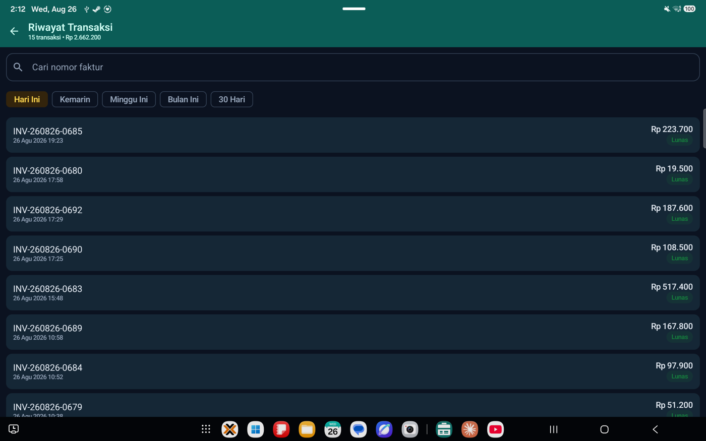

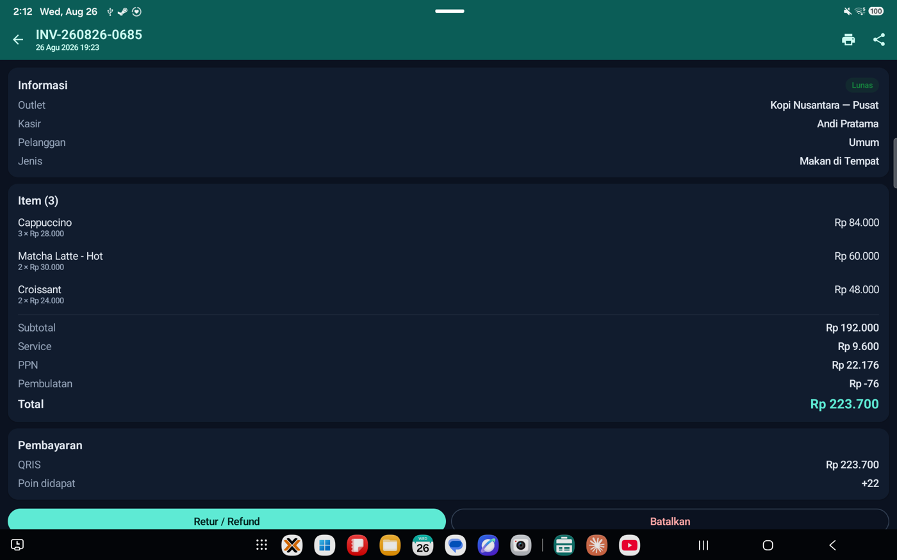

Tekan **Retur / Refund**.

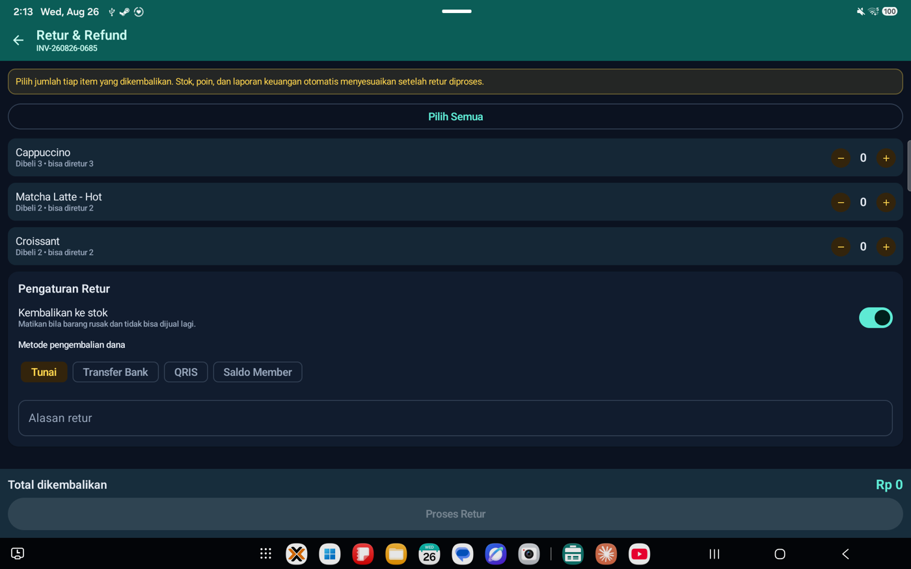

1. Tentukan jumlah tiap item yang dikembalikan (atau **Pilih Semua**).
2. **Kembalikan ke stok** — matikan bila barang rusak dan tidak bisa dijual lagi.
3. Pilih **metode pengembalian dana**: Tunai, Transfer Bank, QRIS, atau Saldo Member.
4. Isi **Alasan retur**, lalu tekan **Proses Retur**.

Stok, poin pelanggan, dan laporan keuangan menyesuaikan otomatis.

Tombol **Batalkan** di layar detail dipakai untuk membatalkan seluruh transaksi (void), bukan
retur sebagian. Aplikasi meminta alasan pembatalan sebelum memprosesnya.

### 6.3 Stok opname

Menu **Stok Opname** → **Opname Baru** → isi catatan (mis. "opname akhir bulan") → **Mulai**.

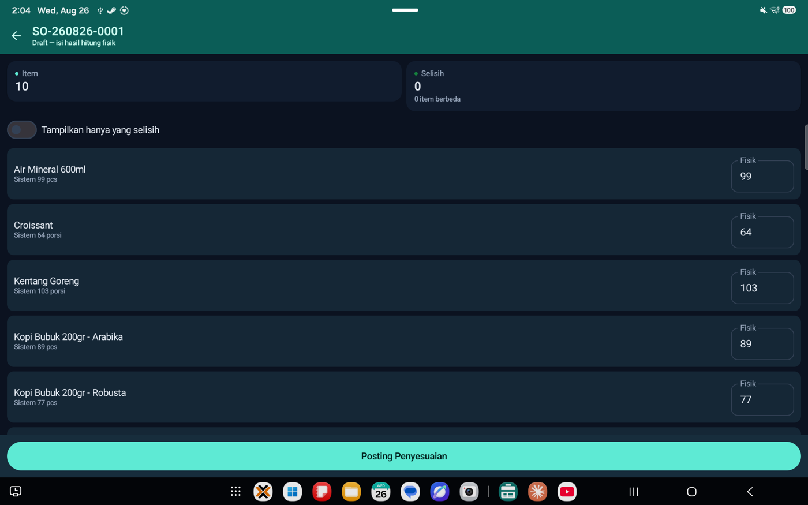

Aplikasi memuat semua produk yang dilacak stoknya beserta jumlah menurut sistem. Isi kolom
**Fisik** dengan hasil hitungan sebenarnya. Sakelar *Tampilkan hanya yang selisih* memudahkan
memeriksa ulang barang yang tidak cocok.

Tekan **Posting Penyesuaian** untuk menerapkan koreksi. Setelah diposting, opname tidak bisa
diubah lagi — jadi periksa dulu sebelum menekan tombol itu.

---

## 7. Panduan Peran: Manajer

Manajer mewarisi semua kemampuan Supervisor, ditambah kendali atas katalog, harga, pembelian,
promo, karyawan, dan pengaturan toko. Manajer juga bisa melihat **Laba Kotor dan HPP**.

### 7.1 Produk dan harga

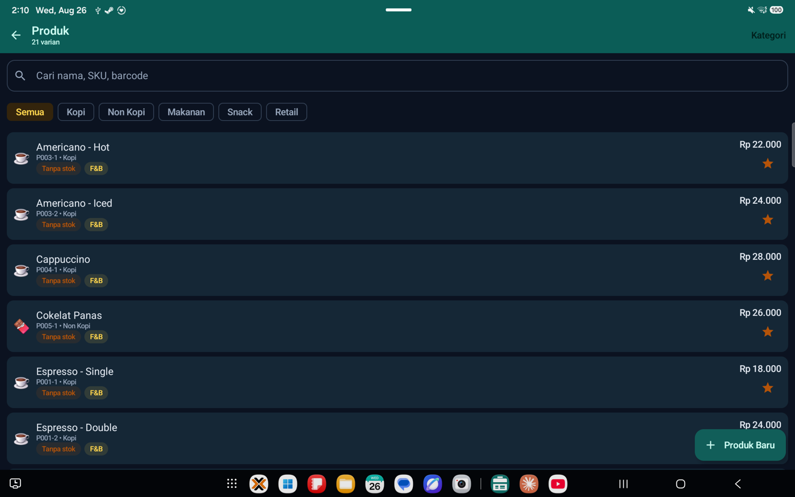

Daftar menampilkan tiap varian beserta SKU, kategori, harga, dan label statusnya
(*Tanpa stok*, *F&B*). Bintang menandai produk favorit yang tampil lebih dulu di layar kasir.

- **Produk Baru** — menambah produk beserta varian, harga jual, HPP, dan barcode.
- **Kategori** (kanan atas) — mengatur nama, warna, dan urutan kategori.
- Untuk produk F&B, resep bahan baku diatur dari layar produk sehingga stok bahan berkurang
  otomatis setiap penjualan.

### 7.2 Pembelian (Purchase Order)

**Pembelian (PO)** → **PO Baru** → pilih pemasok → **Buat**.

Tambahkan barang lewat tombol **+**, isi jumlah dan harga beli satuan. HPP terakhir ditampilkan
sebagai acuan.

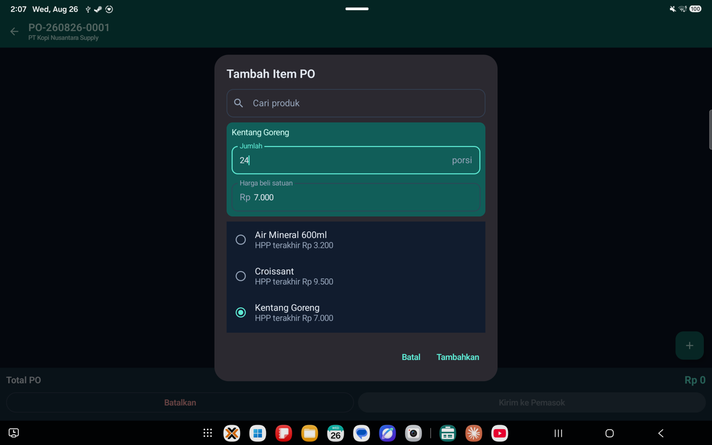

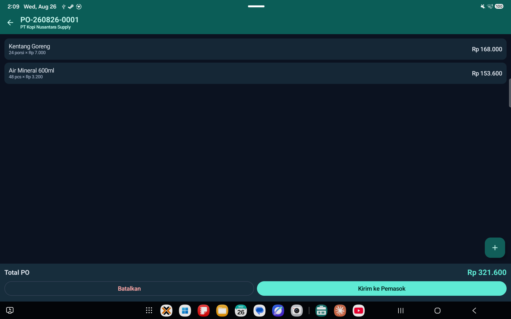

Alur status PO:

1. **Draft** — masih bisa ditambah, diubah, atau dibatalkan.
2. **Kirim ke Pemasok** — PO terkunci, tombol berubah menjadi *Terima Barang*.
3. **Terima Barang** — stok bertambah dan HPP produk dihitung ulang sebagai rata-rata tertimbang
   antara stok lama dan harga beli yang baru masuk. Penerimaan boleh sebagian; PO berstatus
   *Partial* sampai seluruh jumlah diterima.

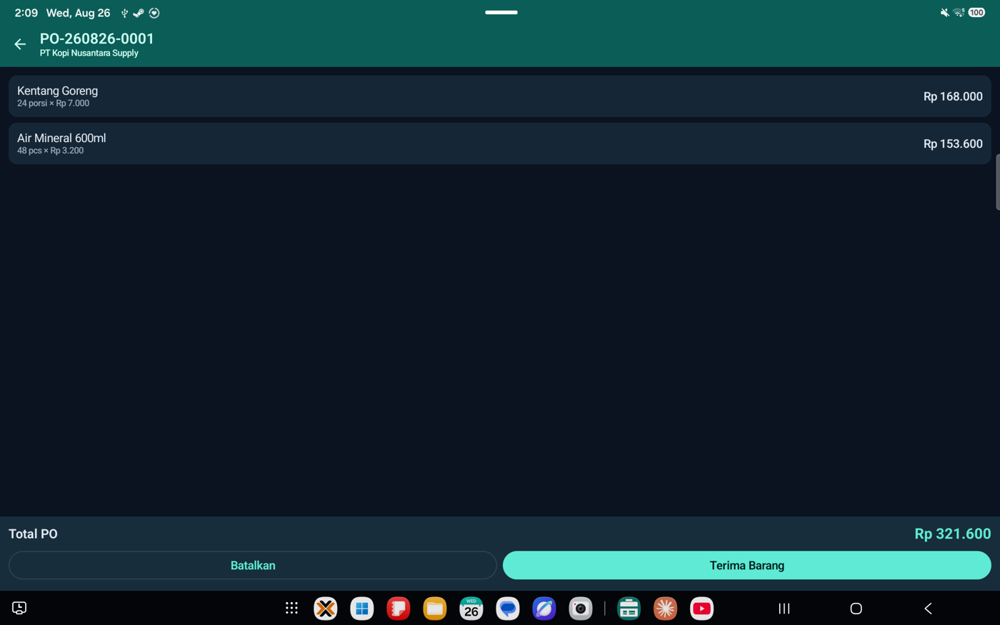

### 7.3 Promo dan voucher

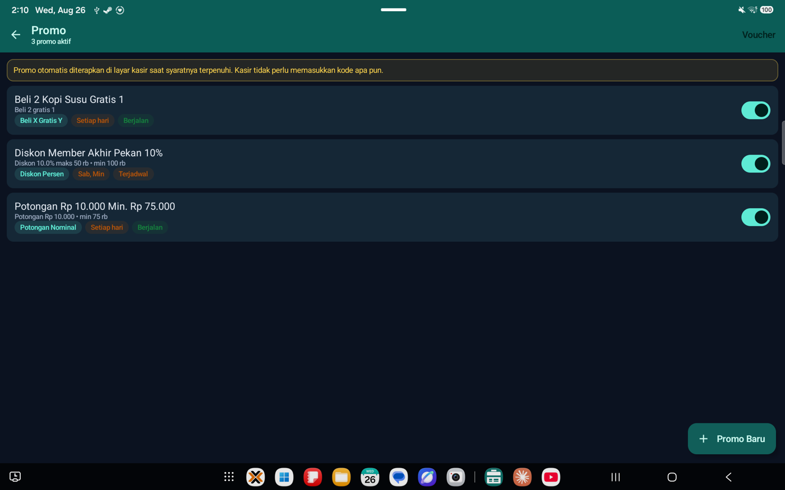

Promo diterapkan **otomatis** di layar kasir saat syaratnya terpenuhi. Setiap promo punya sakelar
aktif/nonaktif dan label yang menjelaskan jenis, jadwal, serta status berjalannya.

Jenis promo yang tersedia: Beli X Gratis Y, Diskon Persen (dengan batas maksimal), dan Potongan
Nominal (dengan minimal belanja). Voucher berkode diatur di layar terpisah lewat tautan
**Voucher** di kanan atas.

### 7.4 Karyawan

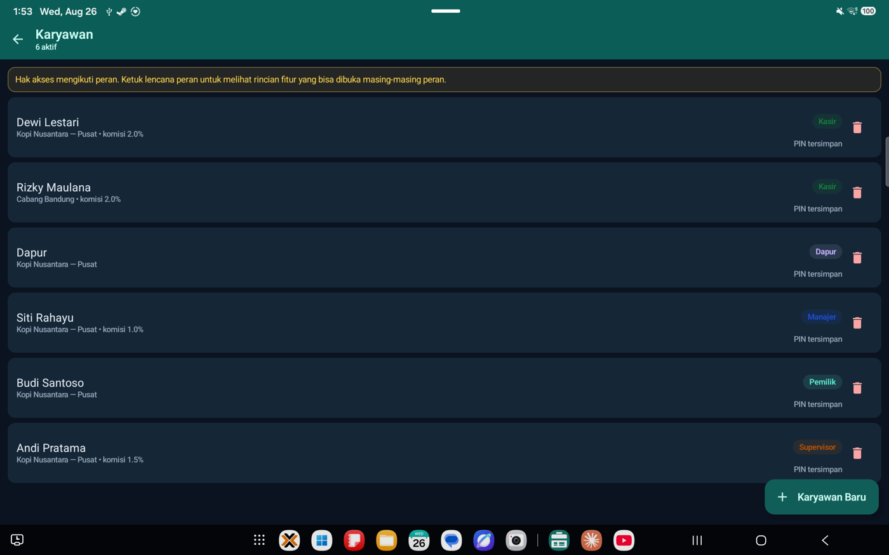

- **Karyawan Baru** — isi nama, peran, outlet, nomor telepon, persentase komisi, dan PIN.
- Ketuk baris karyawan untuk mengubah datanya, termasuk **mengganti PIN**.
- Ketuk **lencana peran** untuk melihat rincian hak akses peran tersebut.
- Ikon tempat sampah menonaktifkan karyawan.

Keterangan *PIN tersimpan* berarti PIN sudah di-hash. Aplikasi tidak pernah menampilkan PIN yang
tersimpan kepada siapa pun — bila lupa, PIN harus diganti dengan yang baru.

Menu terkait: **Absensi** (rekap clock-in/clock-out) dan **Komisi Staf** (komisi dari penjualan).

### 7.5 Pengaturan toko

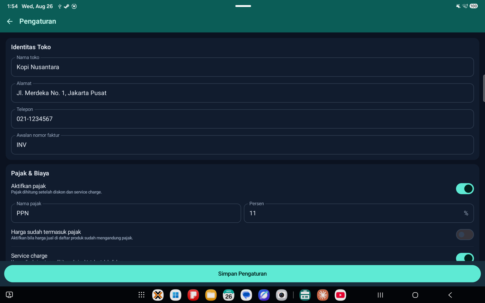

Kelompok pengaturan yang tersedia:

| Kelompok | Isi |
| --- | --- |
| **Identitas Toko** | Nama, alamat, telepon, awalan nomor faktur. Nama toko juga muncul di layar masuk dan struk. |
| **Pajak & Biaya** | Aktifkan pajak, nama dan persentase pajak, harga sudah termasuk pajak, service charge, pembulatan. |
| **Program Poin** | Belanja per 1 poin, nilai tukar 1 poin, minimum poin untuk ditukar. |
| **Mode Bisnis** | Mode Restoran/F&B, Layar Dapur (KDS), peringatan stok menipis. Mematikan mode F&B menyembunyikan menu Manajemen Meja dan Layar Dapur. |
| **Struk** | Catatan kaki struk, lebar kertas (58 mm / 80 mm), cetak otomatis setelah bayar. |
| **Lainnya** | Pintasan ke Printer & Laci Kas, Outlet / Cabang, Backup & Restore, dan Buat Data Contoh. |
| **Bahasa** | Bahasa antarmuka: ikut sistem, Indonesia, atau Inggris. Berlaku seketika tanpa menekan Simpan — lihat [Bahasa aplikasi](#14-bahasa-aplikasi). |
| **Bantuan** | **Panduan Pemakaian** — membuka dokumentasi ini di browser. Satu-satunya bagian aplikasi yang butuh internet, dan hanya untuk membaca panduan. |
| **Tentang** | Versi aplikasi dan keterangan mode luring. |

Perubahan pada kolom dan sakelar baru tersimpan setelah menekan **Simpan Pengaturan**.

> **Perlu diketahui.** Kartu **Outlet** dan **Backup Data** memang tidak muncul di beranda
> Manajer, tetapi kedua layar itu tetap bisa dibuka lewat **Pengaturan → Lainnya**. Pembatasan
> peran di aplikasi ini bekerja dengan menyembunyikan menu, bukan mengunci layarnya. Bila
> Backup dan Outlet benar-benar harus khusus Pemilik, jangan berikan peran Manajer.

---

## 8. Panduan Peran: Pemilik

Pemilik punya seluruh hak akses tanpa kecuali. Menu **Outlet** dan **Backup Data** hanya tampil
di beranda Pemilik (lihat catatan di [Pengaturan toko](#75-pengaturan-toko) soal jalur pintas
lewat Pengaturan).

### 8.1 Laporan

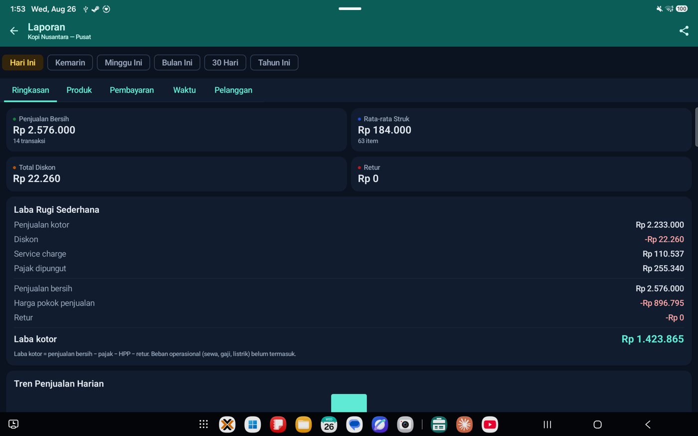

Pilih rentang waktu (Hari Ini, Kemarin, Minggu Ini, Bulan Ini, 30 Hari, Tahun Ini), lalu pilih tab:

| Tab | Isi |
| --- | --- |
| **Ringkasan** | Penjualan bersih, rata-rata struk, total diskon, retur, laba rugi sederhana, dan tren penjualan harian. |
| **Produk** | Produk terlaris dan kontribusinya. |
| **Pembayaran** | Komposisi metode pembayaran. |
| **Waktu** | Sebaran penjualan per jam untuk mengatur jadwal staf. |
| **Pelanggan** | Pelanggan paling aktif. |

Blok **Laba Rugi Sederhana** merinci penjualan kotor → diskon → service charge → pajak →
penjualan bersih → HPP → retur → **laba kotor**. Beban operasional (sewa, gaji, listrik) belum
termasuk. Ikon bagikan di kanan atas mengekspor laporan.

### 8.2 Outlet

Menu **Outlet** dipakai untuk menambah cabang atau gudang. Outlet yang ditandai sebagai gudang
tidak muncul sebagai tempat berjualan, hanya sebagai tujuan transfer stok.

### 8.3 Backup dan Restore

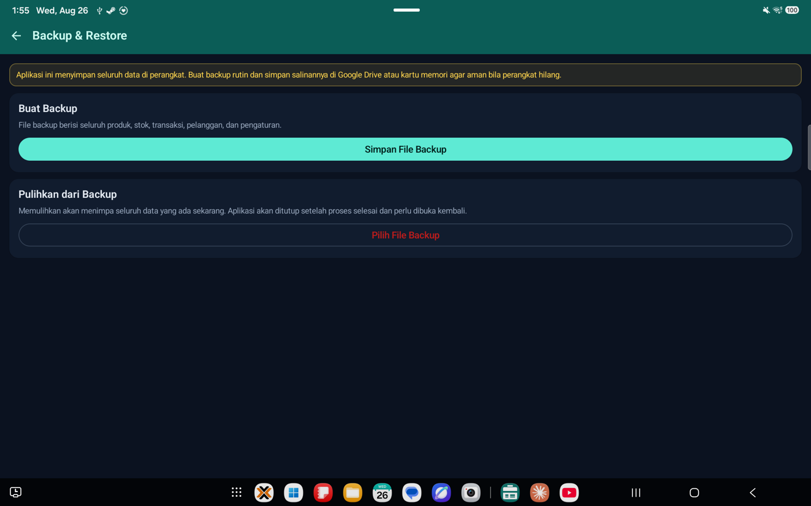

Karena aplikasi menyimpan seluruh data di dalam tablet, **backup adalah satu-satunya perlindungan
bila tablet hilang, rusak, atau dicuri.**

- **Simpan File Backup** — menghasilkan satu berkas berisi seluruh produk, stok, transaksi,
  pelanggan, dan pengaturan. Simpan salinannya ke Google Drive atau kartu memori.
- **Pilih File Backup** (Pulihkan) — **menimpa seluruh data yang ada sekarang**. Aplikasi akan
  ditutup setelah proses selesai dan perlu dibuka kembali.

Anjuran: backup setiap akhir hari, dan simpan salinannya di luar tablet.

---

## 9. Masalah Umum

| Gejala | Penyebab dan solusi |
| --- | --- |
| Menu yang dicari tidak ada di beranda | Peran Anda tidak punya haknya. Lihat [matriks hak akses](#31-matriks-hak-akses); minta Pemilik atau Manajer mengubah peran di menu Karyawan. |
| "Terlalu banyak percobaan" | PIN salah lebih dari 4 kali. Tunggu hitung mundur selesai; layar terbuka sendiri. |
| Banner "Shift belum dibuka" di beranda | Buka menu **Shift & Kas**, atau keluar lalu masuk lagi untuk mendapat layar Buka Shift. |
| "Printer belum dipilih" saat cetak struk | Pasangkan printer Bluetooth di Android, lalu pilih di **Pengaturan → Printer**. |
| Promo tidak muncul di keranjang | Cek di menu **Promo**: sakelarnya aktif, jadwalnya berjalan hari ini, dan syarat minimal belanja sudah terpenuhi. |
| Menu Manajemen Meja dan Layar Dapur hilang | Mode F&B dimatikan di **Pengaturan → Mode Usaha**. |
| Stok tidak cocok dengan barang fisik | Jalankan **Stok Opname**, isi jumlah fisik, lalu Posting Penyesuaian. |
| Pesanan tidak muncul di Layar Dapur | Pesanan hanya masuk antrean lewat opsi **Simpan Pesanan & Kirim ke Dapur**, bukan lewat pembayaran langsung. |
| Lupa PIN karyawan | PIN tidak bisa dilihat kembali. Pemilik atau Manajer membuka **Karyawan**, ketuk karyawan itu, lalu isi PIN baru. |
| Aplikasi berbahasa Inggris padahal ingin Indonesia | Bawaannya mengikuti bahasa tablet. Pilih **Pengaturan → Bahasa → Bahasa Indonesia** agar tetap Indonesia apa pun bahasa tablet. |
| Menu Bahasa tidak ada | Pemilih bahasa ada di dalam layar Pengaturan, yang hanya bisa dibuka Pemilik dan Manajer. Mintakan pada mereka. |
| Berkas APK gagal dipasang di atas versi Google Play ("aplikasi tidak terpasang" / konflik paket) | Versi Play dan versi APK ditandatangani dengan kunci berbeda, jadi yang satu tidak bisa menimpa yang lain. Perbarui lewat Google Play saja. Bila memang harus pindah jalur, backup dulu, copot, pasang versi lain, lalu pulihkan backup. |
| Sudah pilih Inggris tapi nama produk tetap Indonesia | Yang diterjemahkan hanya teks aplikasi. Nama produk, nama toko, dan catatan kaki struk adalah data yang Anda isi sendiri — ubah di menunya masing-masing. |

---

## 10. Apa yang Baru

Panduan ini pertama ditulis untuk versi 1.0.0. Bagian ini menjelaskan apa yang berubah
sejak itu dan apa yang perlu Anda kerjakan. Versi yang sedang berjalan bisa dilihat di
**Pengaturan → Tentang**.

| Versi | Perubahan | Perlu tindakan? |
| --- | --- | --- |
| **1.4.3** | Menu **Bantuan** di Pengaturan, berisi tautan ke panduan ini | Tidak |
| **1.4.2** | Perbaikan hitungan kas shift dan retur di laporan | Tidak — lihat [10.0](#100-hitungan-kas-shift-dan-retur-142) |
| **1.4.1** | Perbaikan internal, tanpa perubahan fitur | Tidak |
| **1.4.0** | Aplikasi dwibahasa: Indonesia dan Inggris | Tidak — bawaannya mengikuti bahasa tablet |
| **1.3.1** | Ikon aplikasi baru | Tidak |
| **1.3.0** | Perbaikan layar masuk dan panel data contoh | Tidak |
| **1.2.0** | Penyesuaian Android 16, izin jaringan dibuang | Tidak |
| **1.1.0** | Identitas aplikasi berubah | **Ya** — lihat [10.4](#104-pindah-dari-versi-100) |

---

### 10.0 Hitungan kas shift dan retur (1.4.2)

Dua perbaikan angka, tanpa fitur baru:

**Kas Seharusnya tidak lagi ikut menghitung kembalian.** Sebelumnya, uang yang diserahkan
pelanggan dicatat utuh — bila pelanggan membayar Rp 100.000 untuk tagihan Rp 75.000, yang masuk
hitungan kas adalah Rp 100.000, padahal Rp 25.000 keluar lagi sebagai kembalian. Akibatnya
**Kas Seharusnya** saat tutup shift terlalu besar dan setiap shift tampak kekurangan uang.
Sekarang kembalian dikurangkan, jadi selisih kas menunjukkan kekurangan atau kelebihan yang
sebenarnya. Rincian per metode di Shift & Kas dan komposisi pembayaran di Laporan ikut benar.

**Retur penuh tidak lagi terpotong dua kali.** Transaksi yang seluruh itemnya diretur dulu
dikeluarkan dari penjualan *dan* returnya tetap dikurangkan, sehingga laba kotor di Laporan dan
Kas Seharusnya di shift turun dua kali lipat nilai retur. Sekarang retur penuh diperlakukan sama
seperti retur sebagian: penjualannya tetap tercatat, returnya dikurangkan sekali.

Perbaikan ini berlaku juga untuk data lama, jadi angka laporan periode yang sudah lewat bisa
berubah (menjadi benar) setelah memperbarui aplikasi. Tidak ada yang perlu Anda kerjakan.

---

### 10.1 Bahasa Indonesia dan Inggris (1.4.0)

Seluruh antarmuka kini punya dua bahasa. Cara memilihnya dan padanan istilahnya ada di
[Bahasa aplikasi](#14-bahasa-aplikasi).

Yang perlu diketahui khusus soal cetakan:

- **Struk pelanggan, tiket dapur, dan laporan shift ikut bahasa yang sedang aktif.** Bila
  tablet disetel Inggris, struk tercetak dengan "TOTAL", "Change", "Cashier".
- **Struk yang sudah tercetak tidak berubah.** Bahasa dipilih saat mencetak, bukan saat
  transaksi dibuat. Mengganti bahasa hari ini tidak mengubah struk kemarin.
- **Nama produk pada struk tetap seperti yang Anda ketik.** Kalau produk dinamai "Kopi Susu",
  begitu pula yang tercetak dalam mode Inggris.

Bila Anda melayani pembeli asing dan ingin struknya berbahasa Inggris, cukup ganti bahasa
sebelum menekan Cetak, lalu kembalikan setelahnya — pergantiannya seketika dan tidak
mengganggu transaksi yang sedang berjalan.

---

### 10.2 Ikon aplikasi baru (1.3.1)

Ikon di layar utama Android berganti dari gambar mesin kasir menjadi lambang **POS** hijau.
Tidak ada yang perlu dikerjakan dan tidak ada perubahan fungsi.

Bila setelah memperbarui aplikasi ikonnya masih yang lama, itu peluncur Android yang menahan
gambar lamanya. Mulai ulang tablet, atau hapus pintasan di layar utama lalu tarik ulang dari
laci aplikasi.

---

### 10.3 Layar masuk lebih jujur (1.3.0)

Tiga perbaikan, semuanya otomatis:

**Titik PIN.** Layar masuk dulu hanya menggambar enam titik padahal PIN boleh sampai delapan
digit — dua digit terakhir diketik tanpa umpan balik apa pun, sehingga terasa seperti tombolnya
tidak berfungsi. Sekarang jumlah titiknya mengikuti panjang PIN yang diizinkan.

**Panel data contoh.** Panel **Buat Data Contoh** beserta daftar PIN bawaan dulu tetap
terpampang di layar masuk setelah karyawan pertama ditambahkan — artinya PIN `1234` sampai
`9999` masih terbaca siapa pun yang memegang tablet. Sekarang panel itu hilang begitu toko
benar-benar dipakai: ada produk, transaksi, pelanggan, meja, promo, voucher, PO, atau karyawan
selain pemilik bawaan.

> **Ini bukan pengganti mengganti PIN.** Panel yang hilang hanya menyembunyikan daftarnya;
> PIN `1234` tetap berlaku sampai Anda menggantinya lewat menu **Karyawan**. Lakukan itu
> sebelum tablet dipakai berjualan.

**Menu Buat Data Contoh di Pengaturan** ikut disembunyikan pada toko yang sudah beroperasi.
Alasannya bukan kerapian: menjalankan data contoh akan **menimpa karyawan nomor 1 sampai 6
beserta PIN-nya**, sehingga akun asli Anda terhapus. Kalau Anda memang ingin mencoba fitur
dengan data contoh, lakukan di tablet lain atau setelah backup.

**Versi di layar Tentang** dibaca langsung dari aplikasi. Angkanya sempat tertinggal di 1.0.0
meski aplikasinya sudah jauh lebih baru, jadi jangan pakai catatan lama untuk menebak versi —
buka **Pengaturan → Tentang**.

---

### 10.4 Pindah dari versi 1.0.0

Ini satu-satunya perubahan yang **menuntut tindakan Anda.**

Bagian ini hanya untuk Anda yang memasang versi 1.0.0 dari berkas APK. Bila aplikasi Anda
berasal dari Google Play, lewati bagian ini.

Sejak 1.1.0 identitas aplikasi berubah dari `com.dpos.kasir` menjadi `id.dpos.kasir`. Android
memperlakukan keduanya sebagai **aplikasi yang berbeda**, jadi versi baru tidak menimpa yang
lama: keduanya terpasang berdampingan, masing-masing dengan datanya sendiri, dan data tidak
berpindah sendiri.

Gejalanya: memasang APK baru gagal dengan pesan `INSTALL_FAILED_UPDATE_INCOMPATIBLE`, atau
berhasil terpasang tetapi aplikasinya kosong seperti pemasangan baru sementara ikon lama masih
ada di laci aplikasi.

**Langkah pindah data — kerjakan berurutan:**

1. **Buka aplikasi lama**, masuk sebagai Pemilik.
2. **Pemilik → Backup Data → Simpan File Backup.** Pilih tujuan **di luar tablet** —
   Google Drive, atau kartu memori. Jangan simpan di folder aplikasi itu sendiri; folder itu
   ikut terhapus saat aplikasi dicopot.
3. **Pastikan berkasnya benar-benar ada** di tujuan sebelum melanjutkan. Buka aplikasi Files
   atau Drive dan lihat ukurannya tidak nol.
4. **Copot aplikasi lama.** Tekan lama ikonnya → Copot pemasangan. Ini menghapus seluruh
   datanya — karena itu langkah 3 tidak boleh dilewati.
5. **Pasang versi baru** dari Google Play atau berkas APK yang Anda terima.
6. **Buka aplikasi baru.** Layar masuk akan tampil seperti pemasangan pertama. Masuk dengan
   PIN bawaan `1234`.
7. **Pemilik → Backup Data → Pilih File Backup**, arahkan ke berkas dari langkah 2.
8. Aplikasi **menutup dirinya sendiri** setelah pemulihan selesai. Buka kembali — seluruh
   produk, stok, transaksi, pelanggan, dan pengaturan sudah kembali.
9. Masuk dengan **PIN lama Anda**, bukan `1234` lagi.

**Yang perlu ditenangkan:**

- **PIN lama tetap berlaku.** Cara penyimpanan PIN sempat diperketat, dan aplikasi mengubah
  PIN lama ke bentuk baru sendiri saat pertama dibuka setelah pemulihan. Anda tidak perlu
  menyetel ulang apa pun.
- **Struktur database tidak berubah** antara 1.0.0 dan 1.4.2, jadi backup lama terbaca utuh —
  tidak ada transaksi atau stok yang hilang dalam perjalanan.
- **Printer tidak perlu dipilih ulang.** Pilihan printer tersimpan di dalam pengaturan, jadi
  ikut kembali bersama backup, dan pemasangan Bluetooth di Android tidak tersentuh sama sekali.
  Tetap lakukan **Tes Cetak** di **Pengaturan → Printer** sebelum berjualan.

> **Kalau ragu, jangan copot dulu.** Selama aplikasi lama masih terpasang, datanya aman.
> Anda boleh memasang versi baru lebih dulu, mencobanya dengan data kosong, dan baru
> memindahkan data setelah yakin. Dua aplikasi berdampingan tidak saling mengganggu.

---

### 10.5 Android 16 dan izin pemindai (1.2.0)

Aplikasi disesuaikan dengan Android 16 dan **izin akses jaringan dibuang**. Pemindai barcode
memakai model yang sudah tertanam di dalam aplikasi, jadi izin itu tidak pernah dipakai.

Artinya di layar Izin Aplikasi, DPos Kasir tidak lagi meminta akses internet sama sekali —
sesuai janji aplikasi luring. Yang tetap diminta hanya **Kamera** (memindai barcode) dan
**Perangkat di sekitar / Bluetooth** (printer termal). Keduanya baru diminta saat fiturnya
dipakai pertama kali, dan boleh ditolak bila Anda tidak memakai pemindai atau printer.
